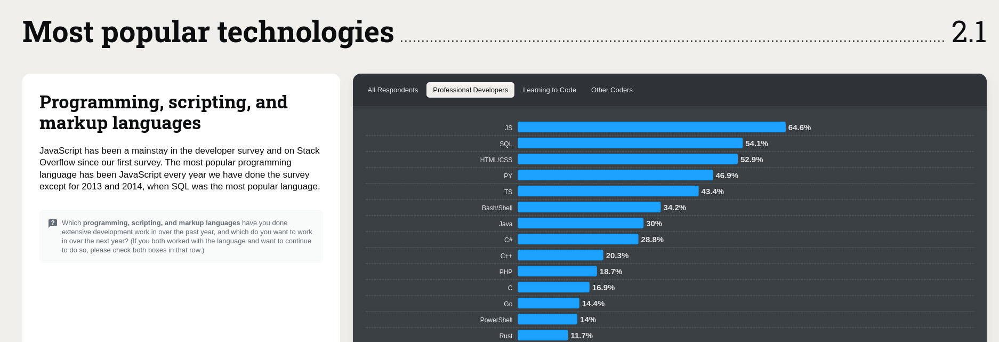

# JavaScript Essentials: Data Types, Operators, and ECMAScript Overview

- [JavaScript Essentials: Data Types, Operators, and ECMAScript Overview](#javascript-essentials-data-types-operators-and-ecmascript-overview)
  - [Most popular technologies](#most-popular-technologies)
  - [ECMAScript](#ecmascript)
    - [Key Points About ECMAScript:](#key-points-about-ecmascript)
  - [Data Type](#data-type)
  - [Primitive Data Types](#primitive-data-types)
    - [1. Number](#1-number)
    - [2. String](#2-string)
    - [3. Boolean](#3-boolean)
    - [4. Undefined](#4-undefined)
    - [5. Null](#5-null)
    - [6. Symbol](#6-symbol)
    - [7. BigInt](#7-bigint)
  - [Non-Primitive (Reference) Data Types](#non-primitive-reference-data-types)
    - [1. Object](#1-object)
    - [2. Array (a special type of object)](#2-array-a-special-type-of-object)
    - [3. Function (a special type of object)](#3-function-a-special-type-of-object)
  - [Input](#input)
  - [Output](#output)
  - [Processing](#processing)
  - [Source Code](#source-code)
  - [Machine Code](#machine-code)
  - [Algorithm](#algorithm)
    - [Finding the Largest Number in List (Example)](#finding-the-largest-number-in-list-example)
  - [Js Output Statement](#js-output-statement)
    - [1. `console.log()`](#1-consolelog)
    - [2. `alert()`](#2-alert)
  - [Js Input Statement](#js-input-statement)
    - [1. `prompt()`](#1-prompt)
  - [Operators in Js](#operators-in-js)
    - [1. Arithmetic Operators](#1-arithmetic-operators)
    - [2. Assignment Operators](#2-assignment-operators)
    - [3. Comparison (Relational) Operators](#3-comparison-relational-operators)
    - [4. Logical Operators](#4-logical-operators)
    - [5. Unary Operators](#5-unary-operators)
  - [NaN in JavaScript](#nan-in-javascript)

## Most popular technologies

As we can see, the `js` is most popular.



source of this [image](https://survey.stackoverflow.co/2024/technology#most-popular-technologies-language-prof).

## ECMAScript

ECMAScript (often abbreviated as ES) is a specification for scripting languages, including JavaScript. It defines the syntax, semantics, and core features of the language. JavaScript is an implementation of the ECMAScript specification.

### Key Points About ECMAScript:

- **Standardization:** ECMAScript is standardized by ECMA International. The standardization process helps ensure consistency across different JavaScript engines and environments.

- **Versions:** The ECMAScript standard evolves over time with new versions. Each version of ECMAScript introduces new features and improvements. For example, ES5 (ECMAScript 5) was released in 2009, and ES6 (ECMAScript 2015) brought significant updates like classes and modules.

- **Feature Evolution:** New features and syntax enhancements are proposed, reviewed, and standardized through the ECMAScript specification. These features eventually make their way into JavaScript engines and, therefore, into browsers and other JavaScript environments.

[Visit the official Link](https://ecma-international.org/publications-and-standards/standards/ecma-262/)

## Data Type

A data type is a classification that specifies which type of value a variable can hold and what operations can be performed on that value. In programming, data types define the nature of the data and ensure that operations are performed correctly.

In `JavaScript`, data types are categorized into two main groups: `primitive` and `non-primitive` (also known as `reference`) data types. Understanding these helps in handling and manipulating data effectively.

JavaScript has 8 DataTypes:

1. `String` (primitive data types)
2. `Number` (primitive data types)
3. `Bigint` (primitive data types)
4. `Boolean` (primitive data types)
5. `Undefined` (primitive data types)
6. `Null` (primitive data types)
7. `Symbol` (primitive data types)
8. `Object` (non-primitive data types)

## Primitive Data Types

Primitive data types are the basic building blocks in JavaScript. They are immutable and are not objects.

> While you cannot modify the value of a primitive directly, you can reassign a new value to a variable that holds a primitive.

```js
let x = 5; // x holds the value 5
x = 10; // Now x holds a new value 10
```

In this case, `x` initially holds the value `5`, but after reassignment, `x` holds the value `10`. This does not change the original value but rather changes what `x` points to.

There are seven primitive data types:

### 1. Number

Represents both integer and floating-point numbers.

```js
let num = 42;
let pi = 3.14;
```

### 2. String

Represents a sequence of characters enclosed in quotes (single `''`, double`""`, or backticks ` `` `).

```js
let name = "John";
let greeting = "Hello, world!";
let templateString = `Hello, ${name}`;
```

### 3. Boolean

Represents a logical value, either true or false.

```js
let isTrue = true;
let isFalse = false;
```

### 4. Undefined

Represents a variable that has been declared but not yet assigned a value.

```js
let notDefined; //All these data types are built upon the fundamental object type, but they come with additional functionality and specific use cases.
console.log(notDefined); // undefined
```

### 5. Null

Represents a deliberate non-value or a "null" value, indicating the absence of any object value.

```js
let emptyValue = null;
```

### 6. Symbol

A Symbol is a primitive data type introduced in `ECMAScript 6 (ES6)`. It represents a unique and immutable value that is often used as a unique identifier for object properties.

```js
let sym = Symbol("description");
```

### 7. BigInt

BigInt is a primitive data type introduced in `ECMAScript 2020 (ES11)` that allows you to work with integers of arbitrary precision. Unlike the standard Number type which can only safely represent integers up to `2^53 - 1`, BigInt can handle much larger integers.

```js
let bigIntNumber = 1234567890123456789012345678901234567890n;
```

## Non-Primitive (Reference) Data Types

Non-primitive data types are objects and can store collections of values or more complex entities. They are mutable and are accessed by reference.

### 1. Object

A collection of key-value pairs. Objects can be created using either the object literal notation or the new Object() syntax.

```js
let person = {
  name: "Alice",
  age: 30,
  greet: function () {
    console.log("Hello!");
  },
};
```

### 2. Array (a special type of object)

A special type of object used to store ordered collections of values. Arrays are created using square brackets.

```js
let numbers = [1, 2, 3, 4, 5];
```

### 3. Function (a special type of object)

A special type of object used to define reusable blocks of code. Functions are created using the function declaration or expression syntax.

```js
function add(a, b) {
  return a + b;
}
```

> While `Arrays` and `Functions` are categorized as non-primitive data types in JavaScript, they are more specifically types of objects.

The non-primitive (or reference) data types in JavaScript are:

- Objects
- Arrays (a specialized object for lists)
- Functions (a specialized object for executable code)
- Dates (objects for handling dates and times)
- Regular Expressions (objects for pattern matching)

All these data types are built upon the fundamental object type, but they come with additional functionality and specific use cases.

## Input

Input is the data that a program receives from various sources.

## Output

Output is the data that a program produces or displays as a result of its processing.

## Processing

Processing in programming refers to the series of operations or steps that a program performs to transform input data into meaningful output or results. This involves manipulating, analyzing, and interpreting data based on predefined logic or algorithms.

## Source Code

Human-readable instructions written in a programming language. It must be translated into machine code to be executed by a computer.

## Machine Code

The binary instructions that a computer's CPU executes directly. It is specific to the CPU's architecture and is the result of compiling or assembling source code.

## Algorithm

A step-by-step procedure for solving a problem or performing a task. It is abstract, code-agnostic and not tied to any specific programming language or machine.

### Finding the Largest Number in List (Example)

- Initialize a variable to hold the largest number (let’s call it max).
- Set max to the first number in the list.
- Iterate through the rest of the numbers in the list:
  - For each number, check if it is greater than max.
  - If it is, update max to this number.
- Continue until all numbers have been checked.
- max will be the largest number in the list.

## Js Output Statement

In `JavaScript`, output statements are used to display information to the user or to log data for debugging purposes.

### 1. `console.log()`

The `console.log()` method is widely used for printing output to the web browser's console. It is useful for debugging and logging information.

```js
console.log("Hello, World!");
let number = 42;
console.log("The number is:", number);
```

### 2. `alert()`

The alert() method displays a dialog box with a message and an OK button. It's useful for simple notifications or debugging but can be disruptive for users.

```js
alert("Hello, World!");
let number = 42;
alert("The number is: " + number);
```

## Js Input Statement

In JavaScript, input statements are used to receive or gather input from users or other sources.

### 1. `prompt()`

The `prompt()` function displays a dialog box that prompts the user to enter some text. This method is often used for simple or quick input tasks.

## Operators in Js

In JavaScript, `operators` are used to perform operations on values and variables.

### 1. Arithmetic Operators

Perform basic arithmetic operations.

| Operator | Name           | What it does                                                                           |
| -------- | -------------- | -------------------------------------------------------------------------------------- |
| `+`      | Addition       | Adds two values. Example: `5 + 3` evaluates to `8`.                                    |
| `-`      | Subtraction    | Subtracts the second value from the first. Example: `5 - 3` evaluates to `2`.          |
| `*`      | Multiplication | Multiplies two values. Example: `5 * 3` evaluates to `15`.                             |
| `/`      | Division       | Divides the first value by the second. Example: `6 / 3` evaluates to `2`.              |
| `%`      | Modulus        | Returns the remainder of the division. Example: `5 % 2` evaluates to `1`.              |
| `**`     | Exponentiation | Raises the first value to the power of the second. Example: `2 ** 3` evaluates to `8`. |

### 2. Assignment Operators

Assign values to variables.

| Operator | Name                      | What it does                                                                                                                                           |
| -------- | ------------------------- | ------------------------------------------------------------------------------------------------------------------------------------------------------ |
| `=`      | Assignment                | Assigns a value to a variable. Example: `let a = 5;`                                                                                                   |
| `+=`     | Addition Assignment       | Adds the right operand to the left operand and assigns the result to the left operand. Example: `a += 3` is equivalent to `a = a + 3;`                 |
| `-=`     | Subtraction Assignment    | Subtracts the right operand from the left operand and assigns the result to the left operand. Example: `a -= 2` is equivalent to `a = a - 2;`          |
| `*=`     | Multiplication Assignment | Multiplies the left operand by the right operand and assigns the result to the left operand. Example: `a *= 4` is equivalent to `a = a * 4;`           |
| `/=`     | Division Assignment       | Divides the left operand by the right operand and assigns the result to the left operand. Example: `a /= 2` is equivalent to `a = a / 2;`              |
| `%=`     | Modulus Assignment        | Takes the modulus of the left operand by the right operand and assigns the result to the left operand. Example: `a %= 3` is equivalent to `a = a % 3;` |

### 3. Comparison (Relational) Operators

Compare two values and return a boolean result.

| Operator | Description              | Example                |
| -------- | ------------------------ | ---------------------- |
| `==`     | Equal to                 | `5 == '5'` -> `true`   |
| `===`    | Strict Equal to          | `5 === '5'` -> `false` |
| `!=`     | Not equal to             | `5 != '6'` -> `true`   |
| `!==`    | Strict Not Equal to      | `5 !== '5'` -> `true`  |
| `>`      | Greater than             | `5 > 3` -> `true`      |
| `<`      | Less than                | `5 < 3` -> `false`     |
| `>=`     | Greater than or equal to | `5 >= 5` -> `true`     |
| `<=`     | Less than or equal to    | `5 <= 6` -> `true`     |

### 4. Logical Operators

Perform logical operations and return a boolean result.

| Operator | Description | Example                     |
| -------- | ----------- | --------------------------- |
| `&&`     | Logical AND | `true && false` -> `false`  |
| `\|\|`   | Logical OR  | `true \|\| false` -> `true` |
| `!`      | Logical NOT | `!true` -> `false`          |

### 5. Unary Operators

Operate on a single operand.
| Operator | Description | Example |
|----------|--------------------------------------|------------------|
| `++` | Increment | `let a = 5; a++` -> `6` |
| `--` | Decrement | `let a = 5; a--` -> `4` |

## NaN in JavaScript

In JavaScript, `NaN` stands for "Not-a-Number." It is a special value that represents the result of a mathematical operation that does not yield a valid number.
For example, `dividing zero by zero` or `attempting to perform arithmetic operations with non-numeric values` can produce NaN.

```js
let result1 = 0 / 0; // NaN
console.log(result1); // Outputs: NaN

let result2 = Math.sqrt(-1); // NaN
console.log(result2); // Outputs: NaN

let result3 = "hello" * 2; // NaN
console.log(result3); // Outputs: NaN

console.log(typeof NaN); // Outputs: 'number'
console.log(NaN === NaN); // Outputs: false
```
