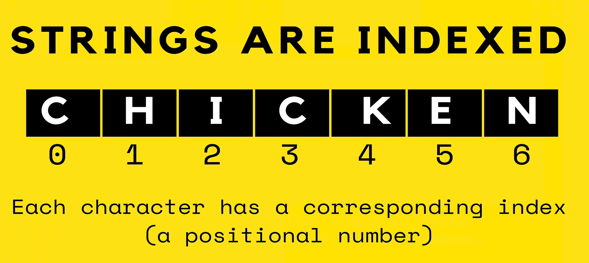

# JavaScript Functions and String Methods: A Comprehensive Guide

- [JavaScript Functions and String Methods: A Comprehensive Guide](#javascript-functions-and-string-methods-a-comprehensive-guide)
  - [Index](#index)
  - [function](#function)
  - [methods](#methods)
    - [1. Built-In Methods](#1-built-in-methods)
    - [2. User-Defined Methods](#2-user-defined-methods)
    - [1. Zero-Based Indexing](#1-zero-based-indexing)
    - [2. One-Based Indexing](#2-one-based-indexing)
  - [Note on String Methods in JavaScript](#note-on-string-methods-in-javascript)
  - [Strings in `JS`](#strings-in-js)
    - [1. Creating Strings](#1-creating-strings)
    - [2. Strings are indexed in JS](#2-strings-are-indexed-in-js)
    - [Length of String](#length-of-string)
    - [String Concatenation](#string-concatenation)
    - [String Methods](#string-methods)
      - [1. `toUpperCase()`](#1-touppercase)
      - [2. `toLowerCase()`](#2-tolowercase)
      - [3. `trim()`](#3-trim)
      - [4. `slice(start, end)`](#4-slicestart-end)
      - [5. `replace(searchValue, newValue)`](#5-replacesearchvalue-newvalue)
      - [6. `split(separator)`](#6-splitseparator)
      - [7. `includes()`](#7-includes)
    - [Template Literals](#template-literals)
    - [Immutability](#immutability)
  - [Special Characters (Escape Sequences)](#special-characters-escape-sequences)
  - [Math Object](#math-object)
    - [Key Properties (Attributes)](#key-properties-attributes)
      - [1. `Math.PI`](#1-mathpi)
      - [2. `Math.E`](#2-mathe)
    - [Key Methods](#key-methods)
      - [1. `Math.abs(x)`](#1-mathabsx)
      - [2. `Math.ceil(x)`](#2-mathceilx)
      - [3. `Math.floor(x)`](#3-mathfloorx)
      - [4. `Math.round(x)`](#4-mathroundx)
      - [5. `Math.max(a, b, ...)`](#5-mathmaxa-b-)
      - [5. `Math.min(a, b, ...)`](#5-mathmina-b-)
      - [6. `Math.random()`](#6-mathrandom)
      - [7. `Math.pow(base, exponent)`](#7-mathpowbase-exponent)
      - [8. `Math.sqrt(x)`](#8-mathsqrtx)
  - [Method Chaining](#method-chaining)

## Index

In programming, an `index` is a numerical position or reference used to access individual elements within a data structure, such as arrays, or strings.

## function

A `function` in programming is a reusable block of code designed to perform a specific task. It can take `inputs (arguments)`, execute a sequence of statements, and optionally return a result.

## methods

In JavaScript, `methods` are `functions` that are associated with `objects`. They can be used to perform operations on the data contained within the object or to execute certain behaviors related to the object. Methods can be found on built-in objects like `arrays` and `strings`, or you can define your own methods in custom objects or classes.

### 1. Built-In Methods

Predefined methods provided by JavaScript's standard objects.

### 2. User-Defined Methods

Methods created by developers within objects or classes.

### 1. Zero-Based Indexing

Most programming languages (including JavaScript, Python, C, and C++) use `zero-based indexing`, where the first element of the array or list is accessed with `index 0`, the second element with `index 1`, and so forth.

<center>


</center>

### 2. One-Based Indexing

Some languages, like MATLAB and Lua, use one-based indexing, where the first element is accessed with `index 1`.

## Note on String Methods in JavaScript

> **_JavaScript provides a wide array of string methods to handle various text processing needs. Given the extensive list of available methods, covering every single one in detail can be quite overwhelming and nearly impossible. It’s important to familiarize yourself with the most commonly used methods and consult the [MDN Web Docs](https://developer.mozilla.org/en-US/docs/Web/JavaScript/Reference/Global_Objects/String) for more comprehensive information on additional methods and their uses._**

## Strings in `JS`

Strings in JavaScript are a fundamental data type used to represent text.

### 1. Creating Strings

Strings can be created using single quotes (`''`), double quotes (`""`), or backticks (` `` `) for template literals.

```js
let singleQuoteString = "Hello, world!";
let doubleQuoteString = "Hello, world!";
let templateLiteralString = `Hello, world!`;
```

### 2. Strings are indexed in JS

In JavaScript, strings are indexed, meaning each character in a string has a numerical index associated with it. This index is `zero-based`, so the first character of the string is at `index 0`, the second character is at `index 1`, and so on.



```js
let str = "Hello";
console.log(str[0]); // Output: "H"
console.log(str.charAt(1)); // Output: "e"
```

### Length of String

we can find the length of a string using the `length` property, which gives the number of characters in the string.

```js
let str = "hello";
console.log(str.length); // Output: 5
```

### String Concatenation

Combine strings using the `+` operator or the `concat` method.

```js
let greeting = "Hello";
let name = "World";
let message = greeting + ", " + name + "!";
console.log(message); // Output: "Hello, World!"

let message2 = greeting.concat(", ", name, "!");
console.log(message2); // Output: "Hello, World!"
```

### String Methods

JavaScript strings come with many `built-in` methods for string manipulation.

#### 1. `toUpperCase()`

Convert the string to uppercase.

```js
console.log("hello".toUpperCase()); // Output: "HELLO"
```

#### 2. `toLowerCase()`

Convert the string to lowercase.

```js
console.log("WORLD".toLowerCase()); // Output: "world"
```

#### 3. `trim()`

Remove whitespace from both ends of the string

```js
console.log("  trim me  ".trim()); // Output: "trim me"
```

#### 4. `slice(start, end)`

Extract a portion of the string

```js
console.log("Hello, World!".slice(7, 12)); // Output: "World"
```

#### 5. `replace(searchValue, newValue)`

Replace occurrences of a substring.

```js
console.log("Hello, World!".replace("World", "JavaScript")); // Output: "Hello, JavaScript!"
```

#### 6. `split(separator)`

Split the string into an array of substrings.

```js
console.log("a,b,c".split(",")); // Output: ["a", "b", "c"]
```

#### 7. `includes()`

In JavaScript, the includes() method is used to determine whether a string contains a specific sequence of characters. It returns a boolean value (true or false).

```js
let message = "Hello, world!";
console.log(message.includes("world")); // Output: true
console.log(message.includes("foo")); // Output: false
```

### Template Literals

Allow for embedded expressions and multi-line strings.

```js
let name = "World";
let message = `Hello, ${name}!`; // String interpolation
console.log(message); // Output: "Hello, World!"

let multiLineStr = `This is a string
that spans multiple lines.`;
console.log(multiLineStr);
```

### Immutability

Strings in JavaScript are immutable, meaning that once a string is created, it cannot be changed. Any operation that modifies a string will actually create a new string.

## Special Characters (Escape Sequences)

You can use `escape sequences` to include special characters in strings

```js
let quote = 'She said, "Hello!"';
let newLine = "First line\nSecond line";
console.log(quote); // Output: She said, "Hello!"
console.log(newLine); // Output: First line
//         Second line
```

## Math Object

The `Math` object in JavaScript is a `built-in` object that provides a collection of methods and properties for mathematical operations.

> It does not create instances and is used directly via the Math namespace.

### Key Properties (Attributes)

#### 1. `Math.PI`

The value of `π (pi)`, approximately `3.14159`.

```js
console.log(Math.PI); // Output: 3.141592653589793
```

#### 2. `Math.E`

The `base of natural logarithms`, approximately `2.718`.

```js
console.log(Math.E); // Output: 2.718281828459045
```

### Key Methods

#### 1. `Math.abs(x)`

Returns the absolute value of `x`.

```js
console.log(Math.abs(-5)); // Output: 5
```

#### 2. `Math.ceil(x)`

Rounds the number `x` up to the nearest integer.

```javascript
console.log(Math.ceil(4.2)); // Output: 5
```

#### 3. `Math.floor(x)`

Rounds `x` down to the nearest integer.

```js
console.log(Math.floor(4.7)); // Output: 4
```

#### 4. `Math.round(x)`

Rounds `x` to the nearest integer.

```js
console.log(Math.round(4.5)); // Output: 5
console.log(Math.round(4.2)); // Output: 4
```

#### 5. `Math.max(a, b, ...)`

Returns the largest of zero or more numbers.

```js
console.log(Math.max(1, 5, 3)); // Output: 5
```

#### 5. `Math.min(a, b, ...)`

Returns the smallest of zero or more numbers.

```js
console.log(Math.min(1, 5, 3)); // Output: 1
```

#### 6. `Math.random()`

Returns a pseudo-random number between 0 (inclusive) and 1 (exclusive).

```js
console.log(Math.random()); // Output: A random number between 0 and 1
```

#### 7. `Math.pow(base, exponent)`

Returns the base raised to the power of the exponent.

```js
console.log(Math.pow(2, 3)); // Output: 8 // (2 ** 3 ==> 8)
```

#### 8. `Math.sqrt(x)`

Returns the square root of x.

```js
console.log(Math.sqrt(16)); // Output: 4
```

## Method Chaining

Method chaining is a programming technique where multiple methods are called on the same object in a single line of code. This is possible when each method returns the object itself (or another object with further methods). It can make code more concise and readable by reducing the need for intermediate variables.

```js
let str = "hello";
console.log(str.toUpperCase().tolowerCase());
```
