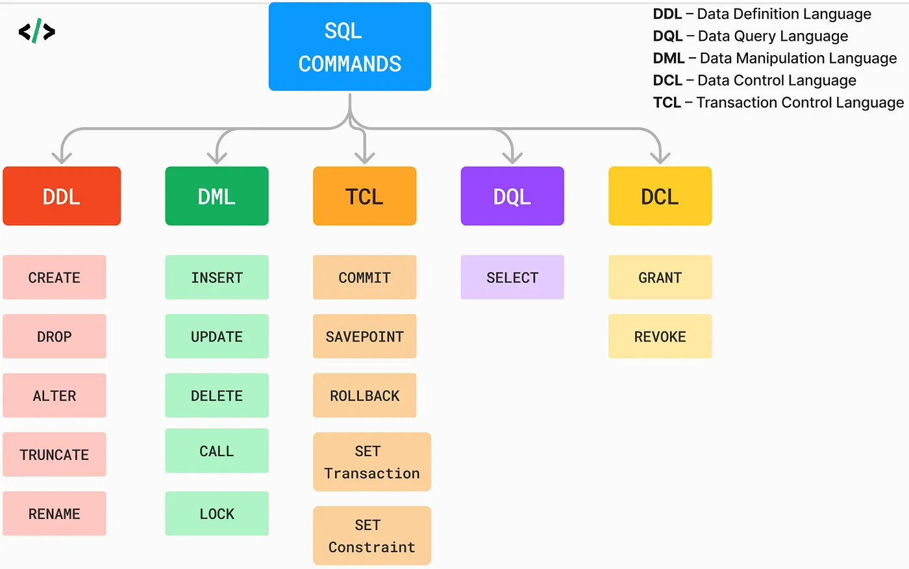

# A Comprehensive Guide to Databases: Concepts, Types, and SQL

- [A Comprehensive Guide to Databases: Concepts, Types, and SQL](#a-comprehensive-guide-to-databases-concepts-types-and-sql)
  - [What is Database?](#what-is-database)
    - [Why We Need Databases](#why-we-need-databases)
    - [Types of Databases:](#types-of-databases)
  - [Types of Databases (`SQL` VS `NoSQL`)](#types-of-databases-sql-vs-nosql)
    - [1. Data Model](#1-data-model)
      - [Relational Databases (SQL)](#relational-databases-sql)
      - [Non-Relational Databases (NoSQL)](#non-relational-databases-nosql)
    - [2. Query Language](#2-query-language)
      - [Relational Databases (`SQL`)](#relational-databases-sql-1)
      - [Non-Relational Databases (`NoSQL`)](#non-relational-databases-nosql-1)
    - [3. Scalability](#3-scalability)
      - [Relational Databases (SQL)](#relational-databases-sql-2)
      - [Non-Relational Databases (NoSQL)](#non-relational-databases-nosql-2)
    - [4. Transactions](#4-transactions)
      - [Relational Databases (SQL)](#relational-databases-sql-3)
      - [Non-Relational Databases (NoSQL)](#non-relational-databases-nosql-3)
    - [Summary](#summary)
  - [Understanding Relational Database Concepts (SQL)](#understanding-relational-database-concepts-sql)
    - [1. Tables](#1-tables)
    - [2. Rows and Columns](#2-rows-and-columns)
    - [3. Primary Key](#3-primary-key)
    - [4. Foreign Key](#4-foreign-key)
    - [5. Relationships](#5-relationships)
    - [7. Normalization](#7-normalization)
    - [8. Transactions](#8-transactions)
    - [9. Entity-Relationship Diagram (ERD)](#9-entity-relationship-diagram-erd)
  - [What is SQL?](#what-is-sql)
  - [SQL command classification / SQL language classification](#sql-command-classification--sql-language-classification)
    - [1. Data Definition Language (DDL)](#1-data-definition-language-ddl)
    - [2. Data Manipulation Language (DML)](#2-data-manipulation-language-dml)
    - [3. Data Retrieval/Query Language (DRL/DQL)](#3-data-retrievalquery-language-drldql)
    - [4. Data Control Language (DCL)](#4-data-control-language-dcl)
    - [5. Transaction Control Language (TCL)](#5-transaction-control-language-tcl)
    - [Summary](#summary-1)
  - [Basics of SQL Language](#basics-of-sql-language)
    - [2. SQL Data Types](#2-sql-data-types)
    - [3. SQL BASIC COMMANDS](#3-sql-basic-commands)
    - [4. Understand SQL Clauses](#4-understand-sql-clauses)

## What is Database?

A database is a systematic collection of data that is organized and stored in a way that allows for efficient retrieval, management, and manipulation. Databases can range from simple lists to complex systems used by large organizations.

### Why We Need Databases

- **Data Organization:** Databases help in structuring data in a way that makes it easy to access and manage. They use tables, schemas, and relationships to ensure that data is stored logically and efficiently.

- **Efficient Data Retrieval:** With databases, you can quickly search for and retrieve specific pieces of data using queries. This is much faster and more reliable than manually searching through data.

- **Data Integrity:** Databases enforce rules and constraints to ensure that the data is accurate and consistent. This helps in maintaining data quality and avoiding errors.

- **Data Security:** Databases provide mechanisms for controlling access to data, ensuring that only authorized users can view or modify sensitive information.

- **Data Management:** They support complex operations like sorting, filtering, and aggregating data. This makes it easier to generate reports, analyze trends, and make data-driven decisions.

- **Scalability:** Databases can handle large volumes of data and can be scaled up or out to accommodate growing data needs.

- **Concurrency:** Multiple users can access and modify the data simultaneously without interfering with each other, thanks to mechanisms like transactions and locking.

- **Backup and Recovery:** Databases have built-in features for backing up data and recovering it in case of failures or corruption.

- **Automation:** Databases support automated tasks such as scheduled reports, triggers for data changes, and routine maintenance operations.

- **Consistency Across Applications:** For organizations using multiple applications, a centralized database ensures that all applications access and update the same data consistently.

### Types of Databases:

    1. SQL DATABASES
    2. NOSQL DATABASES

Overall, databases are crucial for managing data in a way that is efficient, reliable, and secure, making them essential for businesses, organizations, and even personal projects that involve data.

## Types of Databases (`SQL` VS `NoSQL`)

Understanding the differences between `relational (SQL)` and `non-relational (NoSQL)` databases is crucial for selecting the right database system for a given application.

### 1. Data Model

#### Relational Databases (SQL)

- **Data Structure:** Data is organized into `tables` (also called relations) with `rows` and `columns`. Each table has a defined schema specifying the data types and constraints for each column.
- **Schema**: Fixed schema; each table follows a predefined structure. Schema changes often require `altering` the table and may involve downtime.
- **Relationships**: Data is `normalized` and `relationships` between tables are established through `foreign keys`. Supports complex queries using SQL joins.
- **Example**: MySQL, PostgreSQL, Oracle, Microsoft SQL Server.

#### Non-Relational Databases (NoSQL)

- **Data Structure:** Data can be stored in various formats such as `documents`, `key-value pairs`, `column families`, or `graphs`. No strict schema is required.
- **Schema:** `Flexible` or `schema-less`. Allows for dynamic changes in data structure without altering existing data. Adaptable to changes in the data model.
- **Relationships:** Relationships can be managed in different ways depending on the type of NoSQL database (e.g., embedding documents in MongoDB or linking nodes in a graph database).
- **Example:** MongoDB (document-based), Redis (key-value), Cassandra (column-family), Neo4j (graph).

### 2. Query Language

#### Relational Databases (`SQL`)

- **Query Language:** Uses Structured Query Language (`SQL`) for defining and manipulating data. SQL is standardized and widely used for querying relational databases.
- **Complex Queries**: Supports complex queries, including `joins`, `aggregations`, and `transactions`.
- **Example**: `SELECT \* FROM users WHERE age > 30;`

#### Non-Relational Databases (`NoSQL`)

- **Query Language:** Each NoSQL database has its own query language or API. Not standardized, and query capabilities vary by database type.
- **Complex Queries**: Support for complex queries varies; some NoSQL databases offer rich querying capabilities, while others focus on fast key-based lookups.
- **Example**: MongoDB uses BSON (Binary JSON) and a query API like `db.users.find({ age: { $gt: 30 } })`

### 3. Scalability

#### Relational Databases (SQL)

- **Vertical Scalability:** Typically scales vertically by increasing the resources (CPU, RAM) of a single server. Horizontal scaling (scaling out by adding more servers) is more challenging.
- **Replication**: Supports master-slave replication but can be complex to set up and manage.
- **Example**: Increasing the power of a single MySQL server to handle more load.

#### Non-Relational Databases (NoSQL)

- **Horizontal Scalability:** Designed for horizontal scaling, where data is distributed across multiple servers or nodes. This makes it easier to scale out and handle large volumes of data and high traffic.
- **Replication**: Often includes built-in support for distributed data replication and partitioning.
- **Example**: MongoDB shards data across multiple servers to handle large datasets and high read/write loads.

### 4. Transactions

#### Relational Databases (SQL)

- **ACID Transactions:** Supports `ACID (Atomicity, Consistency, Isolation, Durability)` transactions to ensure reliable and consistent data operations. This is critical for applications requiring strong data integrity and consistency.
- **Example**: Transactions in PostgreSQL ensure that either all operations succeed or none do.

#### Non-Relational Databases (NoSQL)

- **Eventual Consistency**: Many NoSQL databases use eventual consistency rather than `ACID` transactions, which can offer better performance and scalability but may sacrifice immediate consistency in some scenarios.
- **Transactions**: Some NoSQL databases offer transaction support, but it’s often less comprehensive than in relational databases.

### Summary

- **Relational Databases (SQL):** Offer a structured schema, standardized query language (SQL), and strong transaction support with ACID properties. They are ideal for applications with complex relationships and strict consistency requirements.
- **Non-Relational Databases (NoSQL)**: Provide flexible schemas, various data models (document, key-value, column-family, graph), and are designed for horizontal scalability and high performance. They are suitable for applications with large volumes of data, varied data structures, or high traffic.

Understanding these differences will help you select the appropriate database system based on the specific needs and constraints of your application.

## Understanding Relational Database Concepts (SQL)

### 1. Tables

The basic unit of data storage in a relational database. A table is a collection of related data entries and consists of `rows` and `columns`.

Each table has a name and a schema that defines the columns, their data types, and constraints.

```
Table: Employees
+------------+---------+---------+
| EmployeeID | Name    | Age     |
+------------+---------+---------+
| 1          | Alice   | 30      |
| 2          | Bob     | 25      |
+------------+---------+---------+
```

### 2. Rows and Columns

- **Rows:** Each `row` in a table represents a single `record` or instance of the data.
- **Columns:** Each `column` represents a `field` or `attribute` of the data, with a specific data type.

- **Example:** In the `Employees` table:

  - **Row:** `(1, Alice, 30)`
  - **Column:** `Name, Age`

### 3. Primary Key

A unique identifier for each row in a table. It ensures that each record can be uniquely identified.

- **Constraints:** A primary key must be `unique` and `not null`.

**Example:** In the `Employees` table, `EmployeeID` is a primary key.

### 4. Foreign Key

A field (or a set of fields) in one table that uniquely identifies a row of another table. It establishes and enforces a link between the data in the two tables.

- **Constraints:** Ensures referential integrity between tables.

> Referential integrity is a term used in database design to describe the relationship between two tables. It is important because it ensures that all data in a database remains consistent and up to date. It helps to prevent incorrect records from being added, deleted, or modified.

- **Example:** If we have another table `Departments`:

```
Table: Departments
+------------+------------------+
| DepartmentID | DepartmentName |
+------------+------------------+
| 1            | HR             |
| 2            | IT             |
+------------+------------------+
```

In Employees, we might have a `DepartmentID` column as a foreign key

### 5. Relationships

- **One-to-One:** A single row in `Table A` is related to a single row in `Table B`.
- **One-to-Many**: A single row in `Table A` can be related to multiple rows in `Table B`. This is the most common relationship.
- **Many-to-Many**: Multiple rows in `Table A` can be related to multiple rows in `Table B`. This is typically managed with a junction table (This is normalized).

- **Examples:**

  - **One-to-One:** A table `Users` and a table `UserProfiles`, where each user has exactly one profile.
  - **One-to-Many**: A `Customers` table and an `Orders` table, where each customer can have multiple orders.
  - **Many-to-Many**: A Students table and a `Courses` table, with a junction table `Enrollments` to manage which students are enrolled in which courses.

### 7. Normalization

The process of organizing data to reduce redundancy and improve data integrity.

- **Normal Forms:** A series of stages (First Normal Form, Second Normal Form, etc.) that a database schema can go through to achieve normalization.

- **Example:** Normalization involves breaking down a table into smaller tables and defining relationships between them to eliminate redundancy.

### 8. Transactions

A sequence of SQL operations that are executed as a single unit of work. Transactions ensure that a series of operations are completed successfully, or none at all.

### 9. Entity-Relationship Diagram (ERD)

An Entity-Relationship Diagram (ERD) is a visual representation of the entities in a database and the relationships between them. ERDs are used in database design to outline and organize data structure, making it easier to understand how different pieces of data interact within the system.

- **ACID Properties:** `Atomicity, Consistency, Isolation, Durability.`

Relational databases use tables to organize data in a structured format, enforce data integrity through primary and foreign keys, and support complex querying through SQL. Concepts like normalization, indexing, and transactions are crucial for managing and optimizing relational databases. Understanding these concepts provides a strong foundation for working with SQL databases and helps in designing efficient and reliable data systems.

## What is SQL?

`SQL`, or `Structured Query Language`, is a standard programming language specifically designed for managing and manipulating `relational databases`. It provides a way to communicate with a database to perform various operations such as querying data, updating records, and managing database structures. SQL is widely used due to its powerful capabilities and standardization, making it essential for database professionals.

## SQL command classification / SQL language classification

SQL command classification refers to the categorization of SQL statements based on their function and purpose within a relational database management system (RDBMS). The main classifications are:



### 1. Data Definition Language (DDL)

Define or modify database structures (schema).

- **Commands**
  - `CREATE:` Creates new database objects such as tables, indexes, or views
    ```SQL
      CREATE TABLE Employees (
        EmployeeID INT PRIMARY KEY,
        FirstName VARCHAR(50),
        LastName VARCHAR(50),
        HireDate DATE
      );
    ```
  - `ALTER`: Modifies existing database objects (e.g., adding or removing columns in a table).
    ```SQL
    ALTER TABLE Employees ADD Email VARCHAR(100);
    ```
  - `DROP`: Deletes database objects (e.g., tables, indexes).
    ```SQL
      DROP TABLE Employees;
    ```
  - `TRUNCATE`: Removes all rows from a table but retains the table structure.
    ```SQL
      TRUNCATE TABLE Employees;
    ```
  - `RENAME`: Changes the name of a database object
    ```SQL
      RENAME TABLE Employees TO Staff;
    ```

### 2. Data Manipulation Language (DML)

Manage and manipulate data within database objects (tables).

- **Commands**

  - `SELECT`: Retrieves data from one or more tables.
    ```SQL
      SELECT * FROM Employees WHERE HireDate > '2023-01-01';
    ```
  - `INSERT`: Adds new rows to a table
    ```SQL
      INSERT INTO Employees (EmployeeID, FirstName, LastName, HireDate) VALUES (1, 'John', 'Doe', '2024-09-17');
    ```
  - `UPDATE`: Modifies existing data in a table.

    ```SQL
      UPDATE Employees SET Email = 'john.doe@example.com' WHERE EmployeeID = 1;
    ```

  - `DELETE`: Removes rows from a table
    ```SQL
      DELETE FROM Employees WHERE EmployeeID = 1;
    ```

### 3. Data Retrieval/Query Language (DRL/DQL)

Query and retrieve data from the database. In many systems, DRL is considered a subset of DML.

- **Commands**

  - `SELECT`: This command is used to retrieve data and is the primary command in DRL.

    ```SQL
      SELECT FirstName, LastName FROM Employees WHERE HireDate BETWEEN '2022-01-01' AND '2024-01-01' ORDER BY HireDate DESC;

    ```

### 4. Data Control Language (DCL)

Control access to data in the database.

- **Commands**
  - `GRANT`: Provides users with specific privileges.
  - `REVOKE`: Removes specific privileges from users.

### 5. Transaction Control Language (TCL)

Manage transactions within the database.

- **Commands:**
  - `COMMIT:` Saves all changes made in the current transaction.
    ```SQL
      COMMIT;
    ```
  - `ROLLBACK`: Undoes changes made in the current transaction.
    ```SQL
      ROLLBACK;
    ```
  - `SAVEPOINT`: Sets a point within a transaction to which you can later roll back
    ```SQL
      SAVEPOINT SavepointName;
    ```
  - `SET TRANSACTION`: Configures transaction properties.
    ```SQL
      SET TRANSACTION ISOLATION LEVEL READ COMMITTED;
    ```

### Summary

- **DDL:** Defines or alters database structure (e.g., `CREATE`, `ALTER`, `DROP`).
- **DML:** Manages and manipulates data (e.g., `SELECT`, `INSERT`, `UPDATE`, `DELETE`).
- **DRL:** Specifically focuses on data retrieval (typically `SELECT`).
- **DCL:** Controls access to data (e.g., `GRANT`, `REVOKE`).
- **TCL:** Manages transactions (e.g., `COMMIT`, `ROLLBACK`).

This classification helps in organizing SQL commands and understanding their roles in database operations and management.

## Basics of SQL Language

Structured Query Language (SQL) is a standard programming language for managing and manipulating relational databases.

SQL is used to perform various operations on the data stored in relational databases, including querying, updating, and managing data.

### 2. SQL Data Types

- **Numeric Types:** `INT`, `FLOAT`, `DECIMAL`
- **Character Types:** `CHAR`, `VARCHAR`, `TEXT`
- **Date/Time Types:** `DATE`, `DATETIME`, `TIMESTAMP`
- **Boolean Type:** `BOOLEAN`

### 3. SQL BASIC COMMANDS

- **Creating a Database and Tables**

  ```SQL
  CREATE DATABASE my_database;
  USE my_database;

  CREATE TABLE Employees (
      EmployeeID INT PRIMARY KEY,
      FirstName VARCHAR(50),
      LastName VARCHAR(50),
      HireDate DATE
  );
  ```

- **Inserting Data**

  ```SQL
  INSERT INTO Employees (EmployeeID, FirstName, LastName, HireDate)
  VALUES (1, 'John', 'Doe', '2024-01-01');
  ```

- **Querying Data**

  ```SQL
  SELECT * FROM Employees;
  SELECT FirstName, LastName FROM Employees WHERE HireDate > '2023-01-01';
  ```

- **Updating Data**

  ```SQL
  UPDATE Employees SET LastName = 'Smith' WHERE EmployeeID = 1;
  ```

- **Deleting Data**

  ```SQL
    DELETE FROM Employees WHERE EmployeeID = 1;
  ```

- **Altering Tables**

  ```SQL
  ALTER TABLE Employees ADD Email VARCHAR(100);
  ```

- **Dropping Tables**

  ```SQL
  DROP TABLE Employees;
  ```

- **Dropping Database**

  ```SQL
  DROP DATABASE databasename;
  ```

### 4. Understand SQL Clauses

- **WHERE:** Filter records.

  ```SQL
  SELECT * FROM Employees WHERE LastName = 'Smith';
  ```

- **ORDER BY:** Sort records.

  ```SQL
  SELECT * FROM Employees ORDER BY HireDate DESC;
  ```

- **GROUP BY:** Group records for aggregate functions.

  ```SQL
  SELECT COUNT(*), Department FROM Employees GROUP BY Department;
  ```

- **HAVING:** Filter groups.

  ```SQL
  SELECT Department, COUNT(*) FROM Employees GROUP BY Department HAVING COUNT(*) > 10;

  ```

- **JOIN:** Combine records from multiple tables.

  ```SQL
  SELECT Employees.FirstName, Departments.DepartmentName
  FROM Employees
  INNER JOIN Departments ON Employees.DepartmentID = Departments.DepartmentID;
  ```

Starting with SQL involves understanding the basics of databases, setting up your environment, learning fundamental commands, and practicing with real examples. As you gain more experience, delve into advanced topics and work on projects to solidify your skills. Engaging with the community and utilizing online resources will also help you along the way.
