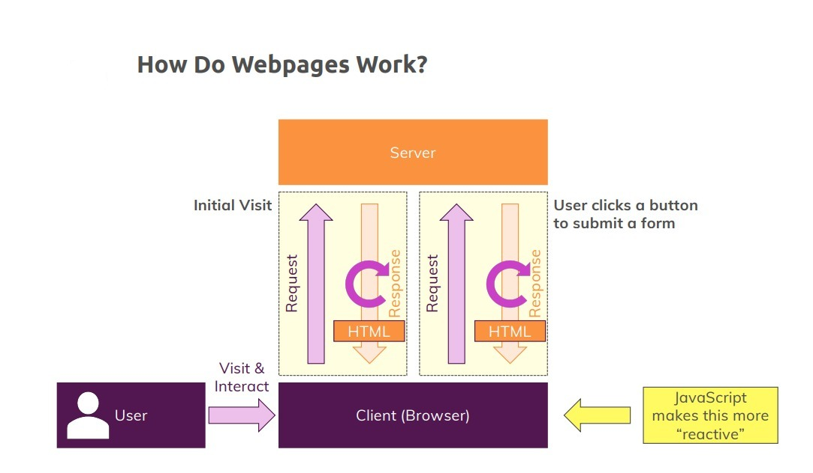

# Introduction to JavaScript: Compilers, Typing Systems, and Variable Fundamentals

- [Introduction to JavaScript: Compilers, Typing Systems, and Variable Fundamentals](#introduction-to-javascript-compilers-typing-systems-and-variable-fundamentals)
  - [What is a Compiler?](#what-is-a-compiler)
  - [What is Interpreter?](#what-is-interpreter)
  - [What is JavaScript?](#what-is-javascript)
  - [Dynamic vs. Static Typing.](#dynamic-vs-static-typing)
    - [Dynamic Typing](#dynamic-typing)
    - [Static Typing.](#static-typing)
  - [Strong Type vs. Weak Type](#strong-type-vs-weak-type)
    - [Strongly Typed](#strongly-typed)
    - [Weakly Typed](#weakly-typed)
  - [JavaScript Environments](#javascript-environments)
  - [Variable](#variable)
  - [Constant](#constant)
  - [Variable naming conventions](#variable-naming-conventions)
    - [1. CamelCase](#1-camelcase)
    - [2. Cannot Be a Reserved Keyword](#2-cannot-be-a-reserved-keyword)
    - [3. Cannot Start with a Number](#3-cannot-start-with-a-number)
    - [4. Cannot Contain Special Characters](#4-cannot-contain-special-characters)
    - [5. Case-Sensitive](#5-case-sensitive)
    - [6. No Spaces](#6-no-spaces)
  - [Variable Declaration and Initialization](#variable-declaration-and-initialization)
    - [Variable Declaration](#variable-declaration)
    - [Variable Initialization](#variable-initialization)
  - [Basic Operators](#basic-operators)

## What is a Compiler?

Translates the entire program into machine code before execution.

[Read More](https://github.com/sameerkatija/sc-advance-web-class/tree/day-3?tab=readme-ov-file#what-is-a-compiler)

## What is Interpreter?

Translates and executes code line by line. Easier to debug but generally slower at runtime. Examples: Python, JavaScript.

[Read More](https://github.com/sameerkatija/sc-advance-web-class/tree/day-3?tab=readme-ov-file#what-is-interpreter)

## What is JavaScript?

JavaScript is a dynamic, weakly typed programming language which is compiled at runtime. It can be executed as part of a webpage in a browser or directly on any machine.

JavaScript was created to make webpages more dynamic (e.g. change content on a
page directly from inside the browser). Originally, it was called `LiveScript` but due to
the popularity of `Java`, it was renamed to `JavaScript`.

> JavaScript is totally independent from Java and has nothing in common with Java!



## Dynamic vs. Static Typing.

### Dynamic Typing

Type checking is performed at runtime, meaning the type of a variable is determined and checked while the program is running.

```JS
let x = 5;       // x is an integer
let x = "hello"; // now x is a string
```

### Static Typing.

Type checking is performed at compile-time, meaning the type of a variable is known and checked before the program runs.

```JAVA
int x = 5;  // x is an integer
x = "hello"; // compilation error: incompatible types
```

## Strong Type vs. Weak Type

### Strongly Typed

A language where types are enforced strictly, and type errors are less common. `Explicit` type conversions are required.

### Weakly Typed

A language with more lenient type rules where implicit type conversions are allowed, sometimes leading to unexpected results.

## JavaScript Environments

JavaScript environments refer to the contexts or platforms where JavaScript code can be executed.

1. **In the Browser:** Runs client-side to create interactive web pages. Example: Handling button clicks, updating content dynamically.

2. **On the Server (Node.js):** Runs server-side to handle backend tasks. Example: Building web servers, managing data.

## Variable

A storage location in a program that can hold a value and whose content can be changed during execution.

> The value can be updated or changed.

```js
let age = 25; // Variable with initial value 25
age = 30; // Value updated to 30
```

## Constant

A storage location in a program that holds a value which cannot be changed once assigned.

> The value cannot be altered after initialization.

```JS
const PI = 3.14; // Constant with value 3.14
// PI = 3.14159; // Error: Cannot assign to 'PI' because it is a constant
```

## Variable naming conventions

When naming variables in programming, it's important to follow conventions to ensure clarity and consistency in your code. Here are some common variable naming conventions:

### 1. CamelCase

`CamelCase` is a naming convention in which words are concatenated without spaces, and each subsequent word starts with a capital letter. It is commonly used in programming for variable names, function names, and other identifiers.

Examples:

- `myVariableName`
- `calculateTotalAmount`
- `userProfileData`

### 2. Cannot Be a Reserved Keyword

In JavaScript, reserved keywords are names that are part of the language's syntax and cannot be used as identifiers (such as variable names, function names, or class names). These reserved words are part of the language specification and have special meanings.

Examples of reserved keywords in JavaScript:

> break, case, catch, class, const, continue, debugger, default, delete, do, else, export, extends, finally, for, function, if, import, in, instanceof, let, new, return, super, switch, this, throw, try, typeof, var, void, while, with, yield

### 3. Cannot Start with a Number

Variable names must begin with a letter (`a-z`, `A-Z`), underscore (`_`), or dollar sign (`$`).

### 4. Cannot Contain Special Characters

Variable names can only include letters, digits (`if not the first character`), underscores (\_), and dollar signs ($).

### 5. Case-Sensitive

Variable names are case-sensitive, meaning myVar and myvar are considered different variables.

### 6. No Spaces

Variable names cannot contain spaces.

## Variable Declaration and Initialization

### Variable Declaration

The process of defining a variable by specifying its name so it can be used in the code. Declaration alone does not assign a value to the variable.

```js
let age; // Declaration of a variable named 'age'
```

### Variable Initialization

The process of assigning a value to a variable at the time of declaration. Initialization sets the variable to a specific value.

```js
age = 30; // initialization of 'age' with value 30
let age = 30; // Declaration and initialization of 'age' with value 30
```

## Basic Operators

| Operator |                                                        |
| :------: | :----------------------------------------------------: |
|    +     |                    Add two numbers                     |
|    -     |                  Subtract two numbers                  |
|    \*    |                  Multiply two numbers                  |
|    /     |                   Divide two numbers                   |
|    %     |         Divide two numbers, returns remainder          |
|   \*\*   | used to raise a number to the power of another number. |
|    =     |                Assign value to variable                |

```js
let sum = 5 + 3; // sum is 8

let difference = 5 - 3; // difference is 2

let product = 5 * 3; // product is 15

let quotient = 6 / 3; // quotient is 2

let remainder = 5 % 2; // remainder is 1

let age = 12; // assign 12 to age variable

let base = 2;
let exponent = 3;
let result = base ** exponent; // 2^3 == 8 output is 8
```
