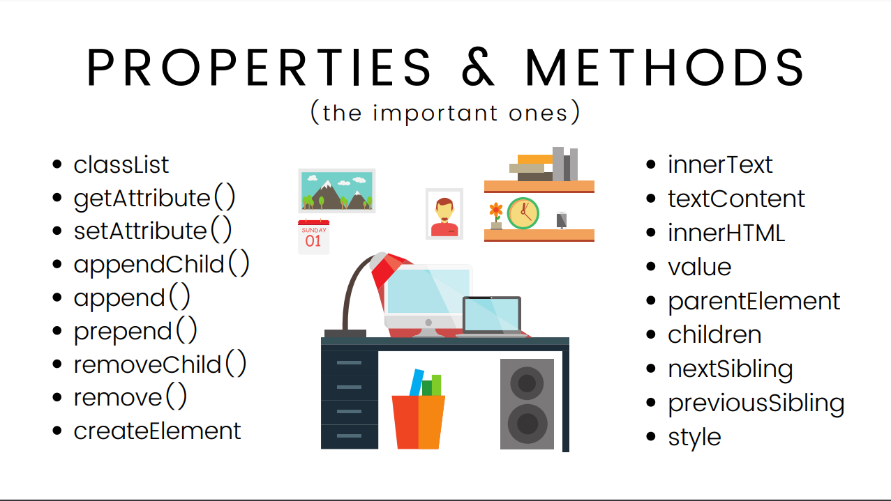

# Mastering Core/Newer JavaScript Concepts and DOM Manipulation

- [Mastering Core/Newer JavaScript Concepts and DOM Manipulation](#mastering-corenewer-javascript-concepts-and-dom-manipulation)
  - [Type Casting](#type-casting)
    - [Implicit Type Conversion](#implicit-type-conversion)
    - [Explicit Type Conversion](#explicit-type-conversion)
      - [Type Conversion Functions](#type-conversion-functions)
  - [Truthy Values](#truthy-values)
  - [Falsy Values](#falsy-values)
    - [Values](#values)
  - [Method](#method)
  - [Higher Order Functions](#higher-order-functions)
    - [FUNCTIONS AS ARGUMENTS (Callback functions)](#functions-as-arguments-callback-functions)
    - [RETURNING FUNCTIONS](#returning-functions)
  - [Error](#error)
  - [Exception](#exception)
  - [Arrow function](#arrow-function)
  - [Some more Array Methods](#some-more-array-methods)
    - [1. `forEach`](#1-foreach)
    - [2. `map`](#2-map)
    - [3. `filter`](#3-filter)
    - [4. `find`](#4-find)
    - [5. `some`](#5-some)
    - [6. `every`](#6-every)
    - [7. `reduce`](#7-reduce)
  - [Newer JavaScript Features](#newer-javascript-features)
    - [1. Spread Operator](#1-spread-operator)
    - [2. Rest params](#2-rest-params)
      - [The difference between rest parameters and the arguments object](#the-difference-between-rest-parameters-and-the-arguments-object)
    - [3. Destructuring](#3-destructuring)
  - [`BOM` and `DOM`](#bom-and-dom)
  - [BOM (Browser Object Model)](#bom-browser-object-model)
    - [1. `window` Object](#1-window-object)
      - [Methods](#methods)
    - [2. screen object](#2-screen-object)
      - [Methods](#methods-1)
  - [DOM (Document Object Model)](#dom-document-object-model)
    - [DOM Tree Structure](#dom-tree-structure)
      - [Root Node:](#root-node)
      - [Element Nodes:](#element-nodes)
      - [Text Nodes:](#text-nodes)
      - [Attribute Nodes:](#attribute-nodes)
    - [`document` object](#document-object)
    - [Selecting Elements in DOM](#selecting-elements-in-dom)
      - [1. `getElementById`](#1-getelementbyid)
      - [2. `getElementsByClassName`](#2-getelementsbyclassname)
      - [3. `getElementsByTagName`](#3-getelementsbytagname)
      - [4. `querySelector`](#4-queryselector)
      - [5. `querySelectorAll`](#5-queryselectorall)
    - [Manipulating Elements in DOM](#manipulating-elements-in-dom)
      - [1. Changing Content](#1-changing-content)
      - [2. Creating and Inserting Elements](#2-creating-and-inserting-elements)
      - [3. Removing Elements](#3-removing-elements)
      - [4. Modifying Attributes](#4-modifying-attributes)
      - [5. Changing Styles](#5-changing-styles)
      - [6. `classList`](#6-classlist)
      - [6. Handling Events](#6-handling-events)

<hr>

## Type Casting

In JavaScript, `typecasting` (or `type conversion`) refers to the process of converting a value from one data type to another. JavaScript is a loosely typed language, meaning that variables can hold values of any type and types can be implicitly or explicitly converted.

### Implicit Type Conversion

JavaScript often performs implicit type conversions automatically. This is also known as type coercion.

```js
let num = 5;
let str = "The number is " + num; // Implicitly converts num to string
console.log(str); // Output: "The number is 5"

let str = "10";
let result = str * 2; // Implicitly converts str to number
console.log(result); // Output: 20

let value = "Hello";
if (value) {
  console.log("This is true"); // "Hello" is truthy
}
```

### Explicit Type Conversion

Explicit type conversion is when you manually convert values to a specific type using built-in functions.

#### Type Conversion Functions

JavaScript provides several functions for converting values:

`String(value)`: Converts value to a string.

`Number(value)`: Converts value to a number.

`Boolean(value)`: Converts value to a boolean.

```js
let num = 123;
let str = String(num); // Converts number to string
console.log(str); // Output: "123"

let str = "123";
let num = Number(str); // Converts string to number
console.log(num); // Output: 123

let intVal = parseInt("123"); // Converts string to integer
let floatVal = parseFloat("123.45"); // Converts string to floating-point number

let str = "Hello";
let bool = Boolean(str); // Converts string to boolean
console.log(bool); // Output: true
```

## Truthy Values

A value is considered `"truthy"` if it evaluates to true in a boolean context.

> Almost all values are truthy, except for those that are explicitly falsy.

## Falsy Values

A value is considered "falsy" if it evaluates to false in a boolean context. JavaScript has exactly seven falsy values.

### Values

1. `false`: The boolean value false.

2. `0`: The number zero. `-0`: The negative zero (treated as equal to 0).

3. `0n`: The BigInt zero.

4. `"" (empty string)`: A string with no characters.

5. `null`: Represents the intentional absence of any object value.

6. `undefined`: Represents a variable that has been declared but not assigned a value.

7. `NaN`: Stands for `"Not-a-Number"`, representing a computation that does not yield a valid number.

## Method

Function defined inside object is known as method.

```js
const person = {
  name: "John",
  age: 19,
  //  defining method
  greet: function () {
    console.log("Hello");
  },
};

// method calling

person.greet();
```

## Higher Order Functions

In JavaScript, a `higher-order function` is a function that either:

1. Takes one or more functions as arguments, or
2. Returns a function as its result.

Higher-order functions are a key concept in functional programming and are used extensively in JavaScript for tasks such as manipulating arrays, handling asynchronous operations, and creating more abstract and reusable code.

### FUNCTIONS AS ARGUMENTS (Callback functions)

> In JavaScript, a callback is a function passed as an argument to another function, which is then invoked inside the outer function to complete some kind of routine or action. Callbacks are fundamental in JavaScript and are commonly used for handling asynchronous operations, such as responding to events, making network requests, or working with timers.

```js
function applyOperation(value, func) {
  let answer = func(value);
  return answer;
}

function square(num) {
  return num ** 2;
}

function double(num) {
  return num * 2;
}

console.log(applyOperation(5, double)); // Output: 10
console.log(applyOperation(5, square)); // Output: 25
```

### RETURNING FUNCTIONS

```js
function createGreeter(greeting) {
  return function (name) {
    return `${greeting}, ${name}!`;
  };
}

const sayHello = createGreeter("Hello");
const sayHi = createGreeter("Hi");

console.log(sayHello("Alice")); // Output: "Hello, Alice!"
console.log(sayHi("Bob")); // Output: "Hi, Bob!"
```

## Error

An error generally refers to an issue that occurs during the execution of a program which typically indicates a serious problem that cannot be handled by the program itself. Errors often represent fundamental problems that prevent the program from continuing its normal execution.

## Exception

An exception is a specific kind of error that occurs during the execution of a program and can be handled by the program itself using mechanisms provided by the programming language. Exceptions represent conditions that a program can potentially recover from.

> Errors indicate unrecoverable system issues beyond program control. In contrast, exceptions represent unexpected events within the program that can often be handled gracefully.

JavaScript uses the `try`, `catch`, `finally`, and `throw` statements to handle exceptions.

```js
try {
  // Code that might throw an exception
  let result = someFunction(); // This function might throw an exception
} catch (error) {
  // Handling the exception
  console.error("An error occurred:", error);
} finally {
  // Code that will always execute, regardless of whether an exception occurred
  console.log("Cleanup or finalization code.");
}
```

## Arrow function

Arrow functions are a feature introduced in `ECMAScript 6 (ES6)` that provide a concise syntax for writing functions in JavaScript. They are often used to make function expressions more readable and to handle some specific cases involving the `this` keyword.

```js
const add = (a, b) => {
  return a + b;
};

console.log(add(2, 3)); // Output: 5

// Implicit Return

const square = (x) => x * x;

console.log(square(4)); // Output: 16
```

## Some more Array Methods

### 1. `forEach`

Executes a provided function once for each array element.

```js
const numbers = [1, 2, 3, 4];
numbers.forEach((num) => console.log(num));
```

### 2. `map`

Creates a new array with the results of calling a provided function on every element.

```js
const numbers = [1, 2, 3, 4];
const doubled = numbers.map((num) => num * 2);
console.log(doubled); // Output: [2, 4, 6, 8]
```

### 3. `filter`

Creates a new array with all elements that pass the test implemented by the provided function.

```js
const numbers = [1, 2, 3, 4, 5];
const evens = numbers.filter((num) => num % 2 === 0);
console.log(evens); // Output: [2, 4]
```

### 4. `find`

Returns the first element in the array that satisfies the provided testing function. If no elements satisfy the function, undefined is returned.

```js
const numbers = [1, 2, 3, 4, 5];
const found = numbers.find((num) => num > 3);
console.log(found); // Output: 4
```

### 5. `some`

Tests whether at least one element in the array passes the test implemented by the provided function. Returns `true` if at least one element passes; otherwise, returns `false`.

```js
const numbers = [1, 2, 3, 4];
const hasNegative = numbers.some((num) => num < 0);
console.log(hasNegative); // Output: false
```

### 6. `every`

Tests whether all elements in the array pass the test implemented by the provided function. Returns true if all elements pass; otherwise, returns false.

```js
const numbers = [1, 2, 3, 4];
const allPositive = numbers.every((num) => num > 0);
console.log(allPositive); // Output: true
```

### 7. `reduce`

Executes a reducer function (that you provide) on each element of the array, resulting in a single output value.

```js
const numbers = [1, 2, 3, 4];
const sum = numbers.reduce((accumulator, currentValue) => accumulator + currentValue, 0);
console.log(sum); // Output: 10
```

## Newer JavaScript Features

### 1. Spread Operator

The spread operator is used to expand an iterable (like an array or object) into individual elements.

```js
const numbers = [1, 2, 3];
const moreNumbers = [0, ...numbers, 4];
console.log(moreNumbers); // Output: [0, 1, 2, 3, 4]

Math.max(...moreNumbers);

const person = { name: "Alice", age: 25 };
const updatedPerson = { ...person, age: 26 };
console.log(updatedPerson); // Output: { name: 'Alice', age: 26 }
```

### 2. Rest params

The rest operator collects multiple elements into a single array or object.

> It looks like spread but it's not

> In JavaScript, the `arguments` object is an array-like object available within all `non-arrow` functions that contains the values of the arguments passed to that function. It provides a way to access and manipulate the arguments of a function dynamically, especially when you don’t know the number of arguments ahead of time.

```js
function sum(...numbers) {
  return numbers.reduce((acc, num) => acc + num, 0);
}

console.log(sum(1, 2, 3, 4)); // Output: 10
```

#### The difference between rest parameters and the arguments object

There are three main differences between rest parameters and the arguments object:

1. The arguments object is not a real array, while rest parameters are Array instances, meaning methods like sort(), map(), forEach() or pop() can be applied on it directly.

2. In a `non-strict` function with simple parameters, the arguments object syncs its indices with the values of parameters. The rest parameter array never updates its value when the named parameters are re-assigned.

3. The rest parameter bundles all the extra parameters into a single array, but does not contain any named argument defined before the ...restParam. The arguments object contains all of the parameters — including the parameters in the ...restParam array — bundled into one array-like object.

### 3. Destructuring

Destructuring allows you to unpack values from arrays or properties from objects into distinct variables.

```js
const [a, b, c] = [1, 2, 3];
console.log(a); // Output: 1
console.log(b); // Output: 2
console.log(c); // Output: 3

const person = { name: "Alice", age: 25, city: "Wonderland" };
const { name, age } = person;
console.log(name); // Output: Alice
console.log(age); // Output: 25

const values = [10, 20, 30, 40];
const [, , third, fourth] = values;

console.log(third); // Output: 30
console.log(fourth); // Output: 40

const numbers = [1, 2, 3, 4, 5];

// Destructure first two elements and gather the rest
const [first, second, ...rest] = numbers;

console.log(first); // Output: 1
console.log(second); // Output: 2
console.log(rest); // Output: [3, 4, 5]
```

## `BOM` and `DOM`

BOM `(Browser Object Model)` and DOM `(Document Object Model)` are two key concepts in web development that interact with the web browser environment and the web page content. They serve different purposes but are closely related in the context of web programming.

## BOM (Browser Object Model)

The BOM provides the objects and methods for interacting with the web browser itself. It includes functionality for handling the browser window, history, navigation, and other browser-specific tasks.

### 1. `window` Object

The `window` object represents the browser window and is the top-level object in the BOM hierarchy. It contains methods for managing the browser environment and interacting with the document.

#### Methods

- `alert(message)`: Displays an alert dialog with a message.

- `confirm(message)`: Displays a confirmation dialog with "OK" and "Cancel"

- `prompt(message, default)`: Displays a prompt dialog that asks the user for input. Returns the input value or null if canceled.

- `setTimeout(callback, delay)`: Executes a function after a specified delay (in milliseconds).

- `setInterval(callback, interval)`: Repeatedly executes a function at specified intervals (in milliseconds).

- `clearTimeout(timeoutId)`: Cancels a timeout previously set by setTimeout.

- `clearInterval(intervalId)`: Cancels an interval previously set by setInterval.

- `location`: Provides access to the URL of the current document and allows navigation.

- `history`: Provides access to the browser's session history.

```js
window.alert("This is an alert message.");
window.confirm("Do you confirm this action?");
prompt("What is your name?", "Guest");

// Define a function to be executed
function showMessage() {
  console.log("This message is shown after 3 seconds.");
}

// Set a timeout to execute the function after 3000 milliseconds (3 seconds)
const timeoutId = setTimeout(showMessage, 3000);

// Optionally, you can cancel the timeout if needed
// clearTimeout(timeoutId);

// Define a function to be executed repeatedly
function updateClock() {
  const now = new Date();
  console.log(`Current time: ${now.toLocaleTimeString()}`);
}

// Set an interval to execute the function every 1000 milliseconds (1 second)
const intervalId = setInterval(updateClock, 1000);

// Optionally, you can cancel the interval if needed
// clearInterval(intervalId);

console.log(`Current URL: ${location.href}`);

// Go back one page in the history

history.back();
history.go(-2);
```

### 2. screen object

The screen object provides information about the screen's dimensions and color depth.

#### Methods

- `width`: Returns the width of the screen in pixels.
- `height`: Returns the height of the screen in pixels.

```js
console.log(`Screen width: ${screen.width}`);
console.log(`Screen height: ${screen.height}`);
```

## DOM (Document Object Model)

The Document Object Model (DOM) represents the structure of an HTML or XML document as an object-oriented tree. This allows you to programmatically access, modify, and manipulate the content, structure, and style of a web page. Here’s a more detailed look at how the DOM works in JavaScript:

> window provides access to document (DOM) among other things. While document is a property of window, the DOM and BOM serve different purposes and are not structured in a parent-child relationship where the DOM is a child of the BOM. Instead, the DOM and BOM are interrelated parts of the web browser's environment that work together to enable dynamic web interactions.

### DOM Tree Structure


#### Root Node:

The DOM tree starts with the root node, which is typically the document object in web browsers. It represents the entire document and serves as the top of the tree.

#### Element Nodes:

Elements are the primary building blocks of the DOM tree and represent HTML tags or XML elements. Each element node can have `child nodes` and `attributes`.

- For example, in the HTML snippet `<div id="container"><p>Hello, World!</p></div>`, there are three element nodes: `<div>`, `<p>`, and the text node inside `<p>`.

#### Text Nodes:

Text nodes contain the text content inside elements. They are leaf nodes in the DOM tree, meaning they don’t have child nodes of their own.

- For example, in `<p>Hello, World!</p>`, "Hello, World!" is a text node.

#### Attribute Nodes:

Attributes are represented as nodes that are associated with element nodes. However, in modern DOM APIs, attributes are generally accessed via properties of element nodes rather than as separate nodes.
For example, in `<div id="container">`, `id="container"` is an attribute node of the `<div>` element.

```js
Document
  ├── html
  │    ├── head
  │    │    └── title
  │    │         └── "Example"
  │    └── body
  │         ├── h1
  │         │    └── "Welcome!"
  │         └── p (id="greeting")
  │              └── "Hello, World!"
```

### `document` object

In the Document Object Model (DOM), the document object represents the entire HTML document and serves as the entry point for accessing and interacting with the content and structure of the document. It provides a wide range of methods and properties to manipulate the document dynamically through JavaScript.

### Selecting Elements in DOM

Selecting elements is a fundamental task in JavaScript for interacting with and manipulating the DOM (Document Object Model). JavaScript provides several methods to select elements from an HTML document, each suited to different use cases.

#### 1. `getElementById`

Selects an element by its unique ID.

```js
const element = document.getElementById("myId");
```

#### 2. `getElementsByClassName`

Selects elements by their class name. Returns a `live HTMLCollection` of elements.

```js
const elements = document.getElementsByClassName("myClass");
// Accessing the first element with that class
const firstElement = elements[0];
```

#### 3. `getElementsByTagName`

Selects elements by their tag name. Returns a `live HTMLCollection` of elements.

```js
const elements = document.getElementsByTagName("p");
// Accessing the first <p> element
const firstParagraph = elements[0];
```

#### 4. `querySelector`

Selects the first element that matches a `CSS selector`. Returns a single Element

```js
const element = document.querySelector(".myClass"); // Selects the first element with class 'myClass'
const elementById = document.querySelector("#myId"); // Selects the element with ID 'myId'
```

#### 5. `querySelectorAll`

Selects all elements that match a CSS selector. Returns a static NodeList of elements.

```js
const elements = document.querySelectorAll(".myClass"); // Selects all elements with class 'myClass'
// Iterating over the NodeList
elements.forEach(function (element) {
  console.log(element.textContent);
});
```

### Manipulating Elements in DOM

Manipulating the DOM (Document Object Model) involves modifying the structure, content, and style of a web document using JavaScript. This can include changing text, adding or removing elements, updating styles, and handling events.

> As we have too many props and methods for manipulating elements, below are some common one. we can't cover all. but we will cover common ones



#### 1. Changing Content

- `textContent`: Updates the text content of an element, replacing any HTML tags inside it.

```js
const element = document.getElementById("myId");
element.textContent = "New text content";
```

- `innerHTML`: Updates the HTML content inside an element.

> Be cautious with this method as it can also execute scripts and may introduce security risks if not used properly.

```js
const element = document.getElementById("myId");
element.innerHTML = "<strong>New HTML content</strong>";
```

#### 2. Creating and Inserting Elements

- `createElement(tagName)`: Creates a new element with the specified tag name.

```js
const newElement = document.createElement("div");
```

- `appendChild(node)`: Appends a new child node to a specified parent node.

```js
const parent = document.getElementById("parentId");
const newElement = document.createElement("p");
newElement.textContent = "New paragraph";
parent.appendChild(newElement);
```

#### 3. Removing Elements

- `removeChild(childNode)`: Removes a child node from its parent node.

```js
const parent = document.getElementById("parentId");
const child = document.getElementById("childId");
parent.removeChild(child);
```

- `remove()`: Directly removes the element from the DOM.

```js
const element = document.getElementById("myId");
element.remove();
```

#### 4. Modifying Attributes

- `setAttribute(name, value)`: Sets a new attribute or updates an existing one on an element.

```js
const element = document.getElementById("myId");
element.setAttribute("class", "newClass");
```

- `getAttribute(name)`: Retrieves the value of an attribute.

```js
const className = element.getAttribute("class");
```

- `removeAttribute(name)`: Removes an attribute from an element.

```js
element.removeAttribute("class");
```

#### 5. Changing Styles

- `style`: Modifies inline styles of an element.

```js
const element = document.getElementById("myId");
element.style.color = "blue";
element.style.fontSize = "20px";
```

#### 6. `classList`

Provides methods to manipulate CSS classes.

- `add(className)`: Adds a class

```js
element.classList.add("newClass");
```

- `remove(className)`: Removes a clas

```js
element.classList.remove("oldClass");
```

- `toggle(className)`: Toggles a class on and off

```js
element.classList.toggle("active");
```

- `contains(className)`: Checks if a class is present.

```js
const hasClass = element.classList.contains("newClass");
```

#### 6. Handling Events

> In JavaScript, an event is an action or occurrence that happens in the browser or user interface, which can be detected and responded to by JavaScript code. Events are fundamental for creating interactive web applications because they allow your code to respond to user actions or other changes in the environment.

> Complete list of DOM events : [W3School](https://www.w3schools.com/jsref/dom_obj_event.asp) & [mdn](https://developer.mozilla.org/en-US/docs/Web/API/Element#events)

- `addEventListener(type, listener)`: Adds an event listener to an element.

```js
const button = document.getElementById("myButton");
button.addEventListener("click", function () {
  alert("Button clicked!");
});
```

- `removeEventListener(type, listener)`: Removes an event listener.

```js
button.removeEventListener("click", myFunction);
```
