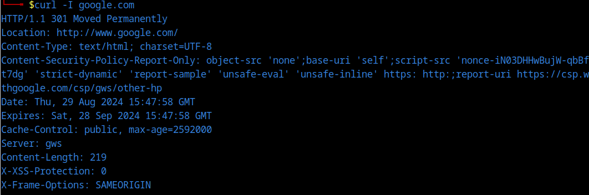

# Comprehensive Guide to Web Communication Protocols, Data Formats, and API Technologies

- [Comprehensive Guide to Web Communication Protocols, Data Formats, and API Technologies](#comprehensive-guide-to-web-communication-protocols-data-formats-and-api-technologies)
  - [What is Protocol?](#what-is-protocol)
    - [1. Key Aspects of Protocols](#1-key-aspects-of-protocols)
      - [1.1 Rules for Communication:](#11-rules-for-communication)
      - [1.2 Standardization:](#12-standardization)
      - [1.3 Error Handling:](#13-error-handling)
      - [1.4 Data Encoding and Decoding:](#14-data-encoding-and-decoding)
      - [1.5 Session Management:](#15-session-management)
    - [2. Examples of Protocols](#2-examples-of-protocols)
      - [2.1 Network Protocols:](#21-network-protocols)
      - [2.2 Communication Protocols:](#22-communication-protocols)
      - [2.3 Security Protocols:](#23-security-protocols)
      - [2.4 Application Protocols:](#24-application-protocols)
  - [HTTP (Hypertext Transfer Protocol)](#http-hypertext-transfer-protocol)
    - [1. Key Features of HTTP](#1-key-features-of-http)
      - [1.1 Application Layer Protocol:](#11-application-layer-protocol)
      - [1.2 Request-Response Model:](#12-request-response-model)
      - [1.3 Stateless Protocol:](#13-stateless-protocol)
      - [1.4 Text-Based:](#14-text-based)
    - [2. Components of HTTP Communication](#2-components-of-http-communication)
      - [2.1. HTTP Requests:](#21-http-requests)
      - [2.2 HTTP Responses:](#22-http-responses)
    - [3. HTTP Methods](#3-http-methods)
    - [4. HTTP Status Codes](#4-http-status-codes)
    - [5. Evolution of HTTP](#5-evolution-of-http)
    - [Summary](#summary)
  - [What is `HTTPS` (Hypertext Transfer Protocol Secure)?](#what-is-https-hypertext-transfer-protocol-secure)
    - [1. Key Features of HTTPS](#1-key-features-of-https)
      - [1.1 Encryption](#11-encryption)
      - [1.2 Data Integrity](#12-data-integrity)
      - [1.3 Authentication](#13-authentication)
    - [2. How HTTPS Works](#2-how-https-works)
      - [2.1 Establishing a Secure Connection](#21-establishing-a-secure-connection)
      - [2.2 Encryption and Decryption](#22-encryption-and-decryption)
    - [3. HTTPS vs. HTTP](#3-https-vs-http)
      - [3.1 HTTP:](#31-http)
      - [3.2 HTTPS:](#32-https)
    - [Summary](#summary-1)
  - [HTTP Communication](#http-communication)
  - [XML vs JSON](#xml-vs-json)
    - [1. XML](#1-xml)
      - [1.1 Key Features](#11-key-features)
        - [1.1.1 Structured Format:](#111-structured-format)
        - [1.1.2 Self-Descriptive:](#112-self-descriptive)
        - [1.1.3 Extensibility:](#113-extensibility)
        - [1.1.4 Attributes:](#114-attributes)
        - [1.1.5 Schema Validation:](#115-schema-validation)
    - [2. JSON (JavaScript Object Notation)](#2-json-javascript-object-notation)
      - [2.1 Key Features](#21-key-features)
        - [2.1.1 Compact Format:](#211-compact-format)
        - [2.1.2 Data Types:](#212-data-types)
        - [2.1.3 Human-Readable:](#213-human-readable)
        - [2.1.4 Parsing and Generation:](#214-parsing-and-generation)
        - [2.1.5 No Attributes:](#215-no-attributes)
    - [3. Comparison](#3-comparison)
    - [Summary](#summary-2)
  - [`AJAX` (Asynchronous JavaScript and XML)](#ajax-asynchronous-javascript-and-xml)
    - [1. Key Features](#1-key-features)
      - [1.1 Asynchronous Requests:](#11-asynchronous-requests)
      - [1.2 Partial Page Updates:](#12-partial-page-updates)
      - [1.3 XML and Other Formats:](#13-xml-and-other-formats)
      - [1.4 JavaScript Integration:](#14-javascript-integration)
    - [2. How AJAX Works](#2-how-ajax-works)
      - [2.1 Client-Side Request:](#21-client-side-request)
      - [2.2 Server-Side Response:](#22-server-side-response)
      - [2.3 Updating the Web Page:](#23-updating-the-web-page)
  - [AJAJ (Asynchronous JavaScript and JSON)](#ajaj-asynchronous-javascript-and-json)
    - [1. Key Features](#1-key-features-1)
      - [1.1 JSON Data Format:](#11-json-data-format)
      - [1.2 Simplicity:](#12-simplicity)
      - [1.3 Improved Performance:](#13-improved-performance)
    - [2. How AJAJ Works](#2-how-ajaj-works)
      - [2.1 Client-Side Request:](#21-client-side-request-1)
      - [2.2 Server-Side Response:](#22-server-side-response-1)
      - [2.3 Updating the Web Page:](#23-updating-the-web-page-1)
  - [Comparison of AJAX and AJAJ](#comparison-of-ajax-and-ajaj)
  - [`fetch` vs `XMLHttpRequest`](#fetch-vs-xmlhttprequest)
    - [1. Modern Syntax and Simplicity](#1-modern-syntax-and-simplicity)
    - [2. Promises and Async/Await](#2-promises-and-asyncawait)
    - [3. Better Error Handling](#3-better-error-handling)
    - [4. Stream Handling](#4-stream-handling)
    - [5. Simpler Configuration](#5-simpler-configuration)
    - [6. Better Support and Modern Features](#6-better-support-and-modern-features)
    - [Summary](#summary-3)
  - [`API` (Application Programming Interface)](#api-application-programming-interface)
    - [1. Key benefits of APIs:](#1-key-benefits-of-apis)

## What is Protocol?

A protocol in computing and telecommunications is a set of rules and conventions that defines how data is transmitted and received over a network. Protocols ensure that data communication between devices is consistent and reliable. They establish the standards for how different devices and systems communicate, ensuring compatibility and effective data exchange.

### 1. Key Aspects of Protocols

#### 1.1 Rules for Communication:

Protocols define the syntax (format of messages), semantics (meaning of messages), and timing (when and how messages are sent and received) of communication.

#### 1.2 Standardization:

Protocols provide standardized methods for communication, ensuring that devices and systems from different manufacturers or developers can interact seamlessly.

#### 1.3 Error Handling:

Many protocols include mechanisms for error detection and correction to ensure data integrity.

#### 1.4 Data Encoding and Decoding:

Protocols specify how data is encoded for transmission and decoded upon reception.

#### 1.5 Session Management:

Some protocols manage the establishment, maintenance, and termination of communication sessions between devices.

### 2. Examples of Protocols

#### 2.1 Network Protocols:

- **`HTTP (Hypertext Transfer Protocol)`:** Used for transferring web pages over the internet.
- **`FTP (File Transfer Protocol)`:** Used for transferring files between computers on a network.
- **`TCP/IP (Transmission Control Protocol/Internet Protocol)`:** The foundational protocol suite for the internet, responsible for ensuring data is sent and received correctly.

#### 2.2 Communication Protocols:

- **`SMTP (Simple Mail Transfer Protocol)`:** Used for sending emails between servers.
- **`POP3 (Post Office Protocol 3)`:** Used by email clients to retrieve emails from a server.
- **`IMAP (Internet Message Access Protocol)`:** Used to access and manage emails on a server.

#### 2.3 Security Protocols:

- **`SSL/TLS (Secure Sockets Layer/Transport Layer Security)`:** Used to encrypt data transmitted over the internet to ensure privacy and security.
- **`HTTPS (Hypertext Transfer Protocol Secure)`:** A secure version of HTTP that uses SSL/TLS to encrypt communication between web browsers and servers.

#### 2.4 Application Protocols:

- **`DNS (Domain Name System)`:** Used to resolve domain names to IP addresses.
- **`DHCP (Dynamic Host Configuration Protocol)`:** Automatically assigns IP addresses to devices on a network.

A protocol is a critical component in computing and networking that specifies the rules and conventions for data exchange between devices. By standardizing how data is formatted, transmitted, and interpreted, protocols ensure that different systems can communicate effectively and reliably. Understanding protocols is essential for designing, managing, and troubleshooting networks and communication systems.

## HTTP (Hypertext Transfer Protocol)

HTTP, or Hypertext Transfer Protocol, is a protocol used for transferring data over the web. It defines how messages are formatted and transmitted, and how web servers and browsers should respond to various commands. HTTP is foundational to web communication, enabling web browsers (clients) to request resources from servers and receive responses.

### 1. Key Features of HTTP

#### 1.1 Application Layer Protocol:

- `HTTP` operates at the application layer of the Internet Protocol Suite. This means it is designed for high-level communication between applications, rather than handling the lower-level details of data transmission.

#### 1.2 Request-Response Model:

- `Request`: A client (such as a web browser) sends an HTTP request to a server. This request asks for a resource (like a web page or image) or performs an action (like submitting a form).

- `Response`: The server processes the request and sends back an HTTP response. This response includes the requested resource and a status code indicating the result of the request.

#### 1.3 Stateless Protocol:

- `HTTP is stateless`, meaning each request from a client to a server is independent of previous requests. The server does not retain any information about past interactions.

#### 1.4 Text-Based:

- HTTP messages are text-based, meaning they are human-readable and consist of plain text. This makes it easier to debug and understand the messages being exchanged.

### 2. Components of HTTP Communication

#### 2.1. HTTP Requests:

- Request Line: Contains the HTTP method, URL, and HTTP version.

  - `Method`: Specifies the action to be performed (e.g., `GET`, `POST`, `PUT`, `DELETE`).
  - `URL (Uniform Resource Locator)`: The address of the resource being requested.
  - `HTTP Version`: The version of HTTP being used (e.g., HTTP/1.1)

  ```bash
  GET /index.html HTTP/1.1
  ```

- `Headers`: Provide additional information about the request. They include metadata such as the type of content being sent or accepted, authentication details, and more.

  ```bash
  Host: www.example.com
  User-Agent: Mozilla/5.0
  ```

- `Body (Optional)`: Contains data sent to the server. This is typically present in methods like `POST` or `PUT`.

  ```js
  {
  "username": "user",
  "password": "pass"
  }
  ```

#### 2.2 HTTP Responses:

- **Status Line:** Contains the HTTP version, status code, and a brief description of the status.
  ```bash
  HTTP/1.1 200 OK
  ```
- **Headers:** Provide additional information about the response, such as the type of content being returned and caching instructions.
  ```bash
  Content-Type: text/html
  Content-Length: 1234
  ```
- **Body:** Contains the main content of the response, such as HTML content, JSON data, or binary data.
  ```html
  <html>
    <body>
      <h1>Welcome to Example.com</h1>
    </body>
  </html>
  ```



### 3. HTTP Methods

- **`GET`:** Requests data from a server. It is read-only and does not modify the resource.
- **`POST`:** Sends data to the server to create or update a resource.
- **`PUT`:** Updates a resource or creates a new one if it doesn’t exist.
- **`DELETE`:** Removes a resource from the server.
- **`PATCH`:** Applies partial modifications to a resource.

### 4. HTTP Status Codes

- **`1xx (Informational)`:** Indicates that the request was received and is being processed.
- **`2xx (Success)`:** Indicates that the request was successful (e.g., 200 OK).
- **`3xx (Redirection)`:** Indicates that further action is needed (e.g., 301 Moved Permanently).
- **`4xx (Client Error)`:** Indicates an error from the client’s side (e.g., 404 Not Found).
- **`5xx (Server Error)`:** Indicates an error from the server’s side (e.g., 500 Internal Server Error).

### 5. Evolution of HTTP

- **`HTTP/1.0`:** The original version, which established the basic principles of HTTP.
- **`HTTP/1.1`:** Introduced features like persistent connections and chunked transfer encoding.
- **`HTTP/2`:** Added features for performance improvements, such as multiplexing and header compression.
- **`HTTP/3`:** Built on QUIC (a transport layer protocol), offering improved performance and security.

### Summary

HTTP is a protocol that governs how data is exchanged over the web. It is essential for the operation of web browsers and servers, facilitating the request and delivery of web content. HTTP is a fundamental building block of web communication, and understanding its principles is crucial for web development and network communication.

## What is `HTTPS` (Hypertext Transfer Protocol Secure)?

`HTTPS (Hypertext Transfer Protocol Secure)` is an extension of HTTP (Hypertext Transfer Protocol) that adds a layer of security to data communication over the internet. HTTPS ensures that data exchanged between a web browser (client) and a web server is encrypted and secure. This is crucial for protecting sensitive information and maintaining privacy and integrity.

### 1. Key Features of HTTPS

#### 1.1 Encryption

- **`TLS/SSL`:** HTTPS uses Transport Layer Security (TLS) or its predecessor, Secure Sockets Layer (SSL), to encrypt the data transmitted between the client and the server. This encryption makes it difficult for third parties to eavesdrop on or tamper with the data being transmitted.

#### 1.2 Data Integrity

- **`Protection Against Tampering`:** Encryption also helps ensure that the data cannot be altered during transmission without detection. This prevents data from being tampered with or corrupted in transit.

#### 1.3 Authentication

- **`Certificate Verification`:** HTTPS uses digital certificates issued by Certificate Authorities (CAs) to verify the identity of the server. This ensures that users are communicating with the legitimate website and not an impostor.

### 2. How HTTPS Works

#### 2.1 Establishing a Secure Connection

- **`Handshake`:** When a client (such as a web browser) connects to a server over HTTPS, a secure connection is established through a process called the TLS handshake. This involves several steps:
  - The client and server agree on encryption algorithms and keys.
  - The server sends its digital certificate to the client.
  - The client verifies the server's certificate with the CA.
  - Both parties generate a shared secret key that will be used to encrypt and decrypt data.

#### 2.2 Encryption and Decryption

Once the secure connection is established, all data exchanged between the client and server is encrypted using the agreed-upon algorithms. This ensures that even if someone intercepts the data, they cannot read or modify it.

### 3. HTTPS vs. HTTP

#### 3.1 HTTP:

- **Unencrypted:** Data sent over HTTP is transmitted in plain text, which can be intercepted and read by anyone with access to the network.
- **No Authentication:** HTTP does not provide mechanisms to verify the identity of the server.

#### 3.2 HTTPS:

- **Encrypted:** Data sent over HTTPS is encrypted, making it secure against eavesdropping and tampering.
- **Authenticated:** HTTPS verifies the identity of the server using digital certificates, helping users ensure they are connecting to a legitimate site.

### Summary

`HTTPS` is a secure version of `HTTP` that uses encryption to protect data transmitted between a client and a server. By ensuring data confidentiality, integrity, and authentication, HTTPS helps safeguard sensitive information and enhances trust in online communications. It is essential for secure transactions, protecting user privacy, and maintaining the overall security of web interactions.

## HTTP Communication


## XML vs JSON

`XML (eXtensible Markup Language)` and `JSON (JavaScript Object Notation)` are two commonly used formats for representing and exchanging data. Both are widely used in web development, APIs, and data storage, but they have different characteristics and use cases.

### 1. XML

`XML` is a markup language designed to store and transport data. It uses a tree structure to represent hierarchical data, where elements are nested within one another.

#### 1.1 Key Features

##### 1.1.1 Structured Format:

`XML` data is organized in a hierarchical structure with a root element and nested child elements. Each element is defined by a tag, and data is enclosed within these `tags`.

##### 1.1.2 Self-Descriptive:

XML is self-descriptive, meaning the tags and structure provide information about the data. For example, <name>John</name> clearly indicates that the value "John" is associated with the tag "name."

##### 1.1.3 Extensibility:

XML allows you to define your own tags and structure, making it flexible and customizable.

##### 1.1.4 Attributes:

XML supports attributes within elements to provide additional information. For example: `<person age="30">John</person>`.

##### 1.1.5 Schema Validation:

XML can be validated against a schema (XSD) to ensure that the data adheres to a specific structure and rules.

```XML

<person>
  <name>John Doe</name>
  <age>30</age>
  <address>
    <street>Main Street</street>
    <city>Springfield</city>
  </address>
</person>

```

### 2. JSON (JavaScript Object Notation)

JSON is a lightweight data interchange format derived from JavaScript object notation. It is used for representing structured data in a human-readable and easy-to-parse format.

#### 2.1 Key Features

##### 2.1.1 Compact Format:

JSON is more compact and less verbose than XML. It uses a simpler syntax with fewer characters.

##### 2.1.2 Data Types:

JSON supports various data types including strings, numbers, objects (key-value pairs), arrays, booleans, and null.

##### 2.1.3 Human-Readable:

JSON’s format is easy to read and write for humans, making it popular for configuration files and data interchange.

##### 2.1.4 Parsing and Generation:

JSON is natively supported in JavaScript and many other programming languages, making it easy to parse and generate.

##### 2.1.5 No Attributes:

Unlike XML, JSON does not support attributes. Data is represented using key-value pairs within objects.

```json
{
  "person": {
    "name": "John Doe",
    "age": 30,
    "address": {
      "street": "Main Street",
      "city": "Springfield"
    }
  }
}
```

### 3. Comparison

| Feature           | XML                                    | JSON                                                |
| ----------------- | -------------------------------------- | --------------------------------------------------- |
| **Syntax**        | Verbose, uses tags and attributes      | Compact, uses key-value pairs                       |
| **Data Types**    | Strings, attributes, elements          | Strings, numbers, objects, arrays                   |
| **Readability**   | Can be harder to read due to verbosity | Easier to read and write                            |
| **Parsing**       | Requires an XML parser                 | Natively supported in JavaScript and many languages |
| **Extensibility** | Highly extensible with custom tags     | Limited to objects and arrays                       |
| **Schema**        | Can be validated with XSD              | No standard schema validation                       |

### Summary

- XML is a flexible, self-descriptive markup language suitable for complex data structures and document-oriented use cases. It is often used in scenarios requiring detailed data representation and validation.

- JSON is a lightweight, easy-to-read format ideal for data interchange, especially in web APIs and applications where simplicity and performance are important.

Both XML and JSON serve important roles in data representation and interchange, and the choice between them often depends on the specific requirements of the application or system.

## `AJAX` (Asynchronous JavaScript and XML)

AJAX is a set of web development techniques that allows web pages to update asynchronously by exchanging small amounts of data with the server behind the scenes. This improves user experience by making web pages feel more responsive and interactive.

### 1. Key Features

#### 1.1 Asynchronous Requests:

AJAX allows web applications to send and receive data asynchronously, meaning the browser can continue to function while data is being fetched or sent.

#### 1.2 Partial Page Updates:

Instead of reloading the entire page, AJAX allows only specific parts of the page to be updated, reducing the need for full page reloads.

#### 1.3 XML and Other Formats:

Originally, AJAX used XML for data interchange, but it can also handle various formats, including JSON, HTML, and plain text.

#### 1.4 JavaScript Integration:

AJAX uses JavaScript (typically via the XMLHttpRequest object or modern fetch API) to handle asynchronous operations.

### 2. How AJAX Works

#### 2.1 Client-Side Request:

The client-side script (JavaScript) creates an XMLHttpRequest object or uses the fetch API to send a request to the server.

#### 2.2 Server-Side Response:

The server processes the request and sends a response back to the client, often in XML format but can also be JSON, HTML, or other formats.

#### 2.3 Updating the Web Page:

JavaScript processes the server’s response and updates the relevant parts of the web page without reloading it.

```js
// Using XMLHttpRequest
var xhr = new XMLHttpRequest();
xhr.open("GET", "/data", true);
xhr.onreadystatechange = function () {
  if (xhr.readyState == 4 && xhr.status == 200) {
    document.getElementById("content").innerHTML = xhr.responseText;
  }
};
xhr.send();
```

## AJAJ (Asynchronous JavaScript and JSON)

`AJAJ` is a variant of AJAX that specifically uses `JSON` (JavaScript Object Notation) as the data format for communication between the client and server. JSON is more lightweight and easier to work with compared to XML.

### 1. Key Features

#### 1.1 JSON Data Format:

AJAJ focuses on using JSON for data interchange, which is generally easier to parse and handle in JavaScript compared to XML.

#### 1.2 Simplicity:

JSON's simplicity and readability make it an attractive choice for data exchange in modern web applications.

#### 1.3 Improved Performance:

JSON is more compact than XML, which can lead to reduced data size and faster parsing times.

### 2. How AJAJ Works

#### 2.1 Client-Side Request:

The client-side script sends an asynchronous request to the server, expecting a JSON response.

#### 2.2 Server-Side Response:

The server processes the request and sends a response in JSON format.

#### 2.3 Updating the Web Page:

JavaScript parses the JSON response and updates the relevant parts of the web page.

```js
// Using fetch API to get JSON data
fetch("/data")
  .then((response) => response.json())
  .then((data) => {
    // Process and update the web page with the JSON data
    document.getElementById("content").innerHTML = data.message;
  });
```

## Comparison of AJAX and AJAJ

| Feature         | AJAX (Asynchronous JavaScript and XML)  | AJAJ (Asynchronous JavaScript and JSON)                         |
| --------------- | --------------------------------------- | --------------------------------------------------------------- |
| **Data Format** | XML (can also handle JSON, HTML, etc.)  | JSON                                                            |
| **Parsing**     | XML parsing can be complex              | JSON parsing is simple and native in JavaScript                 |
| **Data Size**   | XML tends to be larger due to verbosity | JSON is more compact and lightweight                            |
| **Readability** | XML can be harder to read and write     | JSON is easier to read and write                                |
| **Use Case**    | Suitable for scenarios requiring XML    | Preferred for modern web applications where JSON is more common |

- AJAX is a technique for asynchronous web requests and updates, originally using XML but now often using JSON or other formats.
- AJAJ is a specific use of AJAX where JSON is used as the data format, providing a more modern and efficient approach to data interchange compared to XML.

Both AJAX and AJAJ enhance user experience by enabling partial page updates and reducing the need for full page reloads.

## `fetch` vs `XMLHttpRequest`

Both `fetch` and `XMLHttpRequest` are used for making HTTP requests in JavaScript, but fetch is generally preferred for several reasons:

### 1. Modern Syntax and Simplicity

- **Fetch:** The `fetch` API provides a more modern and simpler syntax for making requests. It uses Promises, which makes handling asynchronous operations more straightforward and easier to read.

  ```js
  fetch("/data")
    .then((response) => response.json())
    .then((data) => console.log(data))
    .catch((error) => console.error("Error:", error));
  ```

- **XMLHttpRequest:** The `XMLHttpRequest` (XHR) API uses a more complex callback-based approach, which can lead to deeply nested code and "callback hell."

  ```js
  let xhr = new XMLHttpRequest();
  xhr.open("GET", "/data", true);
  xhr.onreadystatechange = function () {
    if (xhr.readyState === XMLHttpRequest.DONE) {
      if (xhr.status === 200) {
        console.log(JSON.parse(xhr.responseText));
      } else {
        console.error("Error:", xhr.statusText);
      }
    }
  };
  xhr.send();
  ```

### 2. Promises and Async/Await

- **Fetch:** Supports Promises natively, which allows for more elegant handling of asynchronous operations and chaining of operations. Promises also integrate well with async/await syntax, making code cleaner and easier to understand.

  ```js
  async function getData() {
    try {
      let response = await fetch("/data");
      let data = await response.json();
      console.log(data);
    } catch (error) {
      console.error("Error:", error);
    }
  }
  ```

- **XMLHttpRequest:** Does not support Promises out of the box. Using XHR with Promises requires additional code or wrappers to handle asynchronous behavior.

### 3. Better Error Handling

- **Fetch:** Provides a more consistent way to handle errors. `fetch` will only reject the Promise on network errors. HTTP errors (e.g., 404 or 500) will not cause the Promise to reject; instead, they need to be checked manually.

  ```js
  fetch("/data")
    .then((response) => {
      if (!response.ok) {
        throw new Error("Network response was not ok");
      }
      return response.json();
    })
    .then((data) => console.log(data))
    .catch((error) => console.error("Error:", error));
  ```

- **XMLHttpRequest:** Error handling can be more cumbersome and less consistent. XHR requires checking the status and readyState manually, which can be more error-prone.

### 4. Stream Handling

- **Fetch:** Supports streaming of request and response bodies, which allows for more efficient handling of large amounts of data.

  ```js
  fetch("/large-file").then((response) => {
    const reader = response.body.getReader();
    return reader.read().then(function processText({ done, value }) {
      if (done) return;
      console.log(new TextDecoder().decode(value));
      return reader.read().then(processText);
    });
  });
  ```

- **XMLHttpRequest:** Does not have native support for streams. You have to handle large files or data differently.

### 5. Simpler Configuration

- **Fetch:** Configuration with fetch is generally simpler and more intuitive. For instance, setting headers or request bodies is straightforward.

  ```js
  fetch("/data", {
    method: "POST",
    headers: {
      "Content-Type": "application/json",
    },
    body: JSON.stringify({ key: "value" }),
  })
    .then((response) => response.json())
    .then((data) => console.log(data));
  ```

- **XMLHttpRequest:** Configuration can be more verbose and requires setting various properties and methods.

### 6. Better Support and Modern Features

- **Fetch:** As a newer API, fetch is designed with modern web development practices in mind and is generally better supported in modern browsers. It is also designed to be more consistent with other modern web APIs.

- **XMLHttpRequest:** While still supported, XHR is considered older and more cumbersome compared to fetch.

### Summary

- `fetch` is preferred for its modern syntax, native support for Promises, simpler error handling, support for streams, and overall ease of use.

- `XMLHttpRequest` is older and can be more complex and cumbersome to use, but it is still supported in all browsers.

In general, for new code, `fetch` is recommended due to its cleaner API and alignment with modern JavaScript practices.

## `API` (Application Programming Interface)

API stands for Application Programming Interface. It's essentially a set of rules or protocols that allow different software applications to communicate with each other. Think of it as a bridge between two applications, enabling them to share data, functionality, or services.

- An API defines how different software components can interact.
- Developers use APIs to build applications that can access and utilize the features or data of other applications.
- Examples of APIs include those used by social media platforms, weather apps, payment gateways, and more.

### 1. Key benefits of APIs:

- **Efficiency:** Developers can reuse existing functionality instead of building everything from scratch.

- **Innovation:** APIs enable the creation of new and innovative applications.

- **Integration:** APIs allow different systems to work together seamlessly.

In essence, APIs are the building blocks of modern software development, facilitating interoperability and enabling developers to create powerful and interconnected applications.
