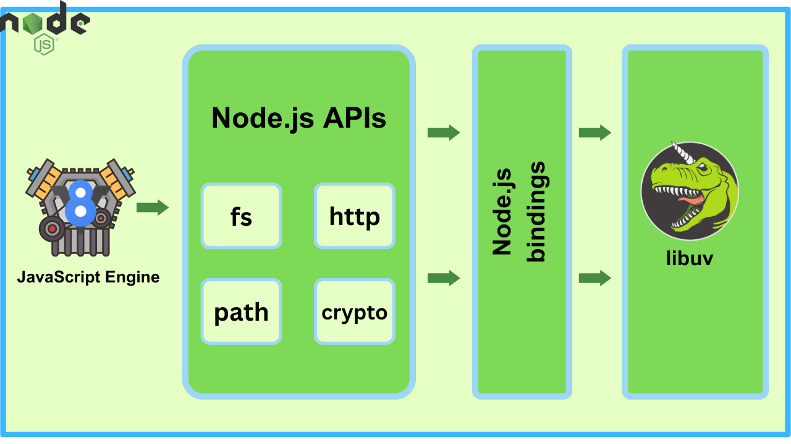

# Understanding Node.js: From Internals to Event-Driven Architecture

- [Understanding Node.js: From Internals to Event-Driven Architecture](#understanding-nodejs-from-internals-to-event-driven-architecture)
  - [What is Node Js](#what-is-node-js)
    - [Key features of Node.js:](#key-features-of-nodejs)
  - [Node Internals Deep Dive](#node-internals-deep-dive)
    - [1. V8 JavaScript Engine](#1-v8-javascript-engine)
      - [Key Features:](#key-features)
    - [2. Node APIs](#2-node-apis)
      - [Key APIs:](#key-apis)
    - [3. Node Bindings](#3-node-bindings)
      - [Key Concepts:](#key-concepts)
    - [4. Libuv](#4-libuv)
      - [Key Features:](#key-features-1)
    - [Conclusion](#conclusion)
  - [Observer Design Pattern](#observer-design-pattern)
    - [Key Components](#key-components)
    - [How It Works](#how-it-works)
  - [Node.js Event-Driven Architecture](#nodejs-event-driven-architecture)
    - [Key Components](#key-components-1)
    - [How It Works](#how-it-works-1)
    - [Conclusion](#conclusion-1)

## What is Node Js

Node.js is a runtime environment that allows you to execute JavaScript code on the server side. It’s built on the V8 JavaScript engine, which is the same engine that powers Google Chrome. Node.js is designed to be lightweight, efficient, and to handle asynchronous operations well, making it suitable for building scalable network applications.

### Key features of Node.js:

- **Event-driven and Non-blocking I/O:** Node.js uses an event-driven, non-blocking I/O model that makes it efficient and lightweight. This model allows Node.js to handle many connections simultaneously without getting bogged down by waiting for operations to complete.

- **Single-threaded Model**: Despite being single-threaded, Node.js can handle multiple connections efficiently due to its event-driven architecture.

- **NPM (Node Package Manager)**: Node.js comes with a package manager called npm, which is the largest ecosystem of open source libraries and tools for JavaScript.

## Node Internals Deep Dive



A deep dive into Node.js internals involves understanding how the various components of Node.js work together under the hood to provide its asynchronous, event-driven architecture.

### 1. V8 JavaScript Engine

V8 is the JavaScript engine developed by Google that Node.js uses to execute JavaScript code. It compiles JavaScript to native machine code for faster execution.

#### Key Features:

- **Just-In-Time (JIT) Compilation:** Converts JavaScript code to machine code at runtime, improving performance.

- **Garbage Collection**: Automatically manages memory by cleaning up unused objects to prevent memory leaks.

- **Hidden Classes and Inline Caching:** To speed up property access, V8 uses hidden classes and inline caching. Hidden classes are internal representations that optimize object property access, while inline caching speeds up property access by caching the location of properties.

In Node.js, V8 is responsible for executing JavaScript code. It handles tasks such as function execution, object manipulation, and memory management. Node.js leverages V8’s efficient execution engine to provide high performance for server-side JavaScript.

### 2. Node APIs

Node APIs are built-in modules provided by Node.js that offer a wide range of functionalities for building server-side applications. These APIs expose methods for performing tasks like handling HTTP requests, file system operations, and networking.

#### Key APIs:

- **http Module:** Provides functionality to create HTTP servers and clients. It allows developers to handle HTTP requests and responses, manage routing, and implement RESTful services.

- **fs (File System) Module**: Enables interaction with the file system. It provides methods for reading, writing, and manipulating files and directories.

- **path Module**: Assists with file and directory path operations. It includes utilities for working with file paths, such as joining, resolving, and normalizing paths.

- **events Module**: Implements an event-driven programming model. It allows objects to emit events and register listeners that respond to these events.

Node APIs provide the core functionalities needed to build various types of applications. They are built on top of V8 and interact with Libuv to handle asynchronous operations, making it easier for developers to perform common tasks without dealing with low-level details.

### 3. Node Bindings

Node bindings are a way to interface with C++ code from Node.js. They allow developers to extend Node’s capabilities by writing native add-ons or integrating existing C++ libraries. This is particularly useful for performance-critical tasks or leveraging existing native libraries.

#### Key Concepts:

- **Native Add-ons:** These are dynamically linked shared objects written in C++ that can be loaded into Node.js using the `require` function. They provide a way to write performance-critical code or access low-level system features.

- **Node-addon-api and NAN**: These are libraries that simplify the creation of native add-ons. node-addon-api provides a C++ API for Node.js add-ons, while `nan` (Native Abstractions for Node) provides an abstraction layer to handle compatibility between different Node.js versions.

- **Building and Linking**: Native add-ons are typically built using `node-gyp`, a tool that automates the process of compiling and linking C++ code with Node.js. It uses configuration files (binding.gyp) to specify how the code should be built.

Node bindings extend the functionality of Node.js by allowing the integration of high-performance C++ code. This can be used to implement custom functionality that is not feasible or efficient in JavaScript alone.

### 4. Libuv

Libuv is a multi-platform C library that provides asynchronous I/O operations. It is a critical component of Node.js, responsible for managing the event loop and handling tasks such as file system operations, networking, and timers.

#### Key Features:

**Event Loop:** The core of Libuv’s functionality is the event loop, which allows Node.js to handle asynchronous operations without blocking the main thread. The event loop continuously checks for and processes events, ensuring that callbacks and tasks are executed when their associated events occur.

**Thread Pool**: For operations that cannot be performed asynchronously (such as file system operations), Libuv uses a thread pool to handle these tasks off the main thread. This helps maintain the non-blocking nature of Node.js by delegating time-consuming tasks to worker threads.

**Handles and Streams**: Libuv uses handles to manage I/O operations such as network sockets and file descriptors. Streams are abstractions built on top of handles that provide a more convenient interface for reading and writing data.

Libuv provides the foundation for Node.js’s non-blocking I/O model. It manages the event loop and asynchronous operations, allowing Node.js to handle multiple concurrent connections efficiently. This architecture enables Node.js to scale and perform well under high loads.

### Conclusion

Understanding the internals of Node.js—specifically the V8 engine, Node APIs, Node bindings, and Libuv—reveals the sophistication behind its efficient, non-blocking I/O model. The V8 engine provides fast JavaScript execution, Node APIs offer essential functionalities for application development, Node bindings allow for integration of native code, and Libuv handles asynchronous operations and the event loop. Together, these components make Node.js a powerful and high-performance runtime for server-side applications.

## Observer Design Pattern

The Observer Design Pattern is a behavioral design pattern used to define a one-to-many dependency between objects. In this pattern, one object (the subject) maintains a list of its dependents (observers) and notifies them automatically of any state changes, usually by calling one of their methods. This pattern is useful for implementing distributed event-handling systems, where changes in one part of the system need to be reflected in other parts.

### Key Components

- **Subject (or Observable):** The object that maintains the list of observers and sends notifications when its state changes.
- **Observer**: The objects that need to be notified of changes in the subject. They implement an update method or similar that is called by the subject.

### How It Works

- **Attach:** Observers register themselves with the subject to receive notifications.
- **Detach**: Observers can unregister themselves if they no longer wish to receive updates.
- **Notify**: When the subject’s state changes, it notifies all registered observers by calling their update methods.

## Node.js Event-Driven Architecture

Node.js is built around an event-driven architecture that uses non-blocking I/O operations. This architecture allows Node.js to handle many connections simultaneously by delegating work to asynchronous operations and using an event loop to manage these operations.

> The event-driven architecture used in Node.js is fundamentally based on the Observer pattern. In fact, the EventEmitter class in Node.js is a practical implementation of the Observer pattern.

### Key Components

- **Event Loop:** The core mechanism that handles asynchronous operations. It manages the execution of callbacks, timers, and I/O operations.
- **Event Emitters**: Objects that emit events and allow listeners to subscribe and react to these events.
- **Event Handlers (Listeners)**: Functions that are registered to respond to specific events emitted by event emitters.

### How It Works

- **Emit Events:** Objects in Node.js, known as event emitters, can emit events using the emit method.
- **Listen for Events**: Listeners can be registered using the on method of an event emitter. When an event is emitted, all registered listeners for that event are called.
- **Event Loop Processing**: The event loop continuously checks for events and executes the associated callback functions. This allows Node.js to perform non-blocking I/O operations and handle multiple tasks concurrently.

```js
const EventEmitter = require("events");

// Create an instance of EventEmitter
class MyEmitter extends EventEmitter {}

const myEmitter = new MyEmitter();

// Listener (Observer)
myEmitter.on("event", (message) => {
  console.log(`Received message: ${message}`);
});

// Emit an event
myEmitter.emit("event", "Hello, Event!");
```

### Conclusion

Node.js’s event-driven architecture is indeed based on the Observer pattern. The EventEmitter class in Node.js implements the core principles of the Observer pattern, allowing objects to emit events and notifying registered listeners. This design facilitates efficient and scalable handling of asynchronous operations, making Node.js a powerful platform for building real-time applications. Understanding this relationship helps in leveraging Node.js’s capabilities effectively and designing robust event-driven systems.
