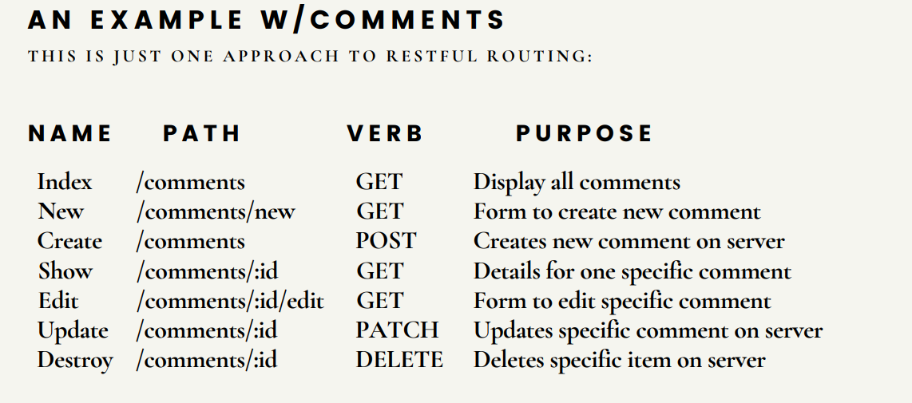

# Understanding HTTP Request Methods, REST Architecture, and Middleware in Express.js

- [Understanding HTTP Request Methods, REST Architecture, and Middleware in Express.js](#understanding-http-request-methods-rest-architecture-and-middleware-in-expressjs)
  - [Request Methods](#request-methods)
    - [1. GET](#1-get)
    - [2. POST](#2-post)
    - [3. PUT](#3-put)
    - [4. DELETE](#4-delete)
    - [5. PATCH](#5-patch)
  - [REST (Representational State Transfer)](#rest-representational-state-transfer)
  - [Middlewares](#middlewares)
    - [Middleware Function Signature](#middleware-function-signature)
    - [Types of Middleware](#types-of-middleware)
      - [1. Application-Level Middleware](#1-application-level-middleware)
      - [2. Route-Level Middleware](#2-route-level-middleware)
      - [3. Built-in Middleware](#3-built-in-middleware)
  - [Global Error handling middlware](#global-error-handling-middlware)

## Request Methods

### 1. GET

- **Purpose**: To retrieve data from a server.
- **Use Case**: When you want to request information without making any changes to the server.
- **Example**: `GET /api/products` might be used to fetch a list of products.

### 2. POST

- **Purpose:** To submit data to the server to create a new resource.
- **Use Case:** When you need to add new data or create a new resource.
- **Example:** `POST /api/products` with a `payload` containing product details would create a new product.

### 3. PUT

- **Purpose:** To update or replace an existing resource with new data.
- **Use Case**: When you need to update an entire resource.
- **Example**: `PUT /api/products/123` with updated product details would replace the product with ID 123.

### 4. DELETE

- **Purpose:** To remove a resource from the server.
- **Use Case:** When you need to delete a specific resource.
- **Example:** `DELETE /api/products/123` would delete the product with ID 123.

### 5. PATCH

- **Purpose:** To partially update an existing resource.
- **Use Case:** When you need to update only some fields of a resource, rather than replacing the entire resource.
- **Example:** `PATCH /api/products/123` with a `payload` containing updated fields (e.g., price) would update only those fields of the product with ID 123.

## REST (Representational State Transfer)

REST stands for Representational State Transfer. It's an architectural style used in web services for designing networked applications. RESTful APIs are built to be simple, scalable, and stateless, often using `HTTP methods` and `URIs` to interact with resources.

REST is a set of guidelines for how a client and server should communicate and perform CRUD (Create, Read, Update, Delete) operations on a given resource.

The main idea of REST (Representational State Transfer) is to treat data on the server-side as resources that can be manipulated through standard CRUD (Create, Read, Update, Delete) operations.



> Further Reading on [REST](https://aws.amazon.com/what-is/restful-api/)

## Middlewares

Middleware functions are functions that execute during the request-response cycle. They have access to the request and response objects, and the next function, which allows them to pass control to the next middleware function or route handler.

In Express, middleware functions are a fundamental part of handling HTTP requests and responses. They are used to perform tasks like modifying request and response objects, ending the request-response cycle, and passing control to the next middleware function in the stack.

### Middleware Function Signature

```js
function (req, res, next) {
  // Middleware logic here
}
```

### Types of Middleware

#### 1. Application-Level Middleware

This type of middleware is attached to the Express application instance using `app.use()`. It runs for every request made to the application.

```js
const express = require("express");
const app = express();

// Application-level middleware
app.use((req, res, next) => {
  console.log("Request received");
  next(); // Pass control to the next middleware
});
```

#### 2. Route-Level Middleware

Middleware can also be attached to specific route. This allows you to apply middleware only to routes.

```js
const routeMiddleware = (req, res, next) => {
  console.log("I ran");
  next();
};

app.get("/", routeMiddleware, (req, res) => {
  res.send("index route");
});
```

#### 3. Built-in Middleware

Express provides several built-in middleware functions that can be used to handle common tasks. Examples include:

- `express.json()`: Parses incoming JSON request bodies.
- `express.urlencoded()`: Parses URL-encoded request bodies.
- `express.static()`: Serves static files from a directory.

```js
app.use(express.json()); // For parsing application/json
app.use(express.urlencoded({ extended: true })); // For parsing application/x-www-form-urlencoded
app.use(express.static("public")); // Serves static files from the "public" directory
```

Middleware in Express.js allows you to handle various aspects of HTTP requests and responses. By using middleware functions, you can perform operations such as logging, authentication, and error handling, providing a modular and flexible approach to building web applications.

## Global Error handling middlware

A global error-handling middleware function is used to handle errors that occur during the request-response cycle. This function has a special signature with four parameters: `err`, `req`, `res`, and `next`. It is designed to catch errors that occur in other middleware or route handlers and send an appropriate response to the client.

```js
app.use((err, req, res, next) => {
  // Set the status code if available, otherwise default to 500
  const statusCode = err.status || 500;

  // Send a response to the client
  res.status(statusCode).json({
    message: err.message || "Internal Server Error",
    // Optionally include more error details for development
    // stack: process.env.NODE_ENV === 'development' ? err.stack : undefined
  });
});
```

A global error-handling middleware in Express.js is essential for managing errors in a centralized manner. By placing it at the end of your middleware stack, you ensure that it catches and processes errors that occur throughout the request-response cycle. This approach helps maintain a clean and manageable error-handling strategy in your application.
