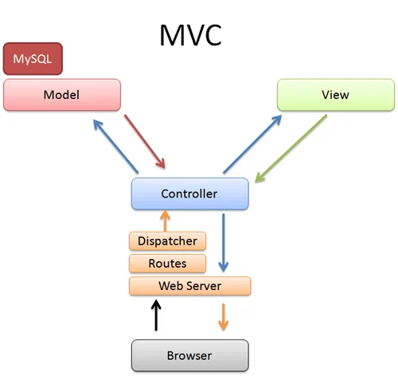

# Advance Express.js: Methods, Cookies, Sessions, and MVC

- [Advance Express.js: Methods, Cookies, Sessions, and MVC](#advance-expressjs-methods-cookies-sessions-and-mvc)
  - [Making `PUT`, `PATCH` and `DELETE` Requests Using `method-override`](#making-put-patch-and-delete-requests-using-method-override)
    - [Step 1: Install Required Packages](#step-1-install-required-packages)
    - [Step 2: Set Up Express and Method-Override](#step-2-set-up-express-and-method-override)
    - [Step 3: Create an HTML Form](#step-3-create-an-html-form)
  - [Cookies Vs Session](#cookies-vs-session)
    - [Cookies](#cookies)
      - [Getting Started with `Cookie`](#getting-started-with-cookie)
    - [Sessions](#sessions)
      - [Getting Started with `Sessions`](#getting-started-with-sessions)
  - [Key Differences](#key-differences)
  - [Conclusion](#conclusion)
  - [Signing Cookies in Express.js](#signing-cookies-in-expressjs)
  - [MVC (Model-View-Controller)](#mvc-model-view-controller)
    - [1. Model](#1-model)
    - [2. View](#2-view)
    - [3. Controller](#3-controller)
    - [Summary](#summary)
  - [`connect-flash` Middleware: Third-Party Package](#connect-flash-middleware-third-party-package)
    - [Using `connect-flash`](#using-connect-flash)
      - [1. Require Necessary Packages](#1-require-necessary-packages)
      - [Configure Middleware](#configure-middleware)
      - [Using Flash Messages](#using-flash-messages)

## Making `PUT`, `PATCH` and `DELETE` Requests Using `method-override`

HTML only supports `POST` and `GET` method. To make `PUT`, `PATCH` and `DELETE` requests we have to use thrid-party packages. We can use the `method-override` package in a Node.js application.

### Step 1: Install Required Packages

```bash
npm install method-override
```

### Step 2: Set Up Express and Method-Override

```js
const express = require("express");
const methodOverride = require("method-override");

const app = express();
const PORT = 3000;

// Middleware to parse request bodies
app.use(express.json());
app.use(express.urlencoded({ extended: true }));

// Method Override
app.use(methodOverride("_method"));

// Start the server
app.listen(PORT, () => {
  console.log(`Server is running on http://localhost:${PORT}`);
});
```

### Step 3: Create an HTML Form

Add the `?_method=DELETE`, `?_method=PUT` or `?_method=PATCH` in the end of action attribute.

```HTML
<form action="/update-item?_method=DELETE" method="POST">
    <input type="hidden" name="_method" value="PUT">
     <button type="submit">Send PUT Request</button>
</form>
```

With these steps, you have successfully set up an Express application that can handle `PUT`, `PATCH` and `DELETE` requests using the method-override middleware. This allows you to simulate different HTTP methods through HTML forms, making your application more flexible and compliant with RESTful standards.

## Cookies Vs Session

In Express.js, cookies and sessions are two important concepts used for managing user state and storing information across multiple requests.

### Cookies

Cookies are small pieces of data stored on the client-side (in the user's browser) that are sent back to the server with each HTTP request. They can be used to remember information about the user, such as preferences or session identifiers.

- **Setting Cookies**: You can set cookies using the `res.cookie()` method in Express.
- **Reading Cookies**: You can access cookies from the `req.cookies` object (requires the cookie-parser middleware).
- **Expiration**: Cookies can have an expiration time set, after which they will be deleted from the browser.

#### Getting Started with `Cookie`

- Install `cookie-parser`
  ```
    npm install cookie-parser
  ```
- Basic Setup and usage

  ```js
  const express = require("express");
  const cookieParser = require("cookie-parser");

  const app = express();
  const PORT = 3000;

  app.use(cookieParser());

  // Setting a cookie
  app.get("/set-cookie", (req, res) => {
    res.cookie("username", "JohnDoe", {
      maxAge: 900000, // Sets the expiration time for a cookie in milliseconds.
      httpOnly: true,
    });
    res.send("Cookie has been set");
  });

  // Reading a cookie
  app.get("/get-cookie", (req, res) => {
    const username = req.cookies.username;
    res.send(`Username from cookie: ${username}`);
  });

  app.listen(PORT, () => {
    console.log(`Server is running on http://localhost:${PORT}`);
  });
  ```

### Sessions

Sessions are server-side storage that allows you to store user data for the duration of their visit. A session typically includes a unique session ID, which is stored in a cookie on the client side. The server maintains session data and associates it with the session ID.

- Sessions are useful for storing temporary data, such as user authentication status, shopping cart contents, or user preferences.
- When a user logs in, you can create a session and store user information, which persists across requests.

#### Getting Started with `Sessions`

- Install `express-session`
  ```bash
    npm install express-session
  ```
- Basic Setup and usage

  ```js
  const express = require("express");
  const session = require("express-session");

  const app = express();
  const PORT = 3000;

  app.use(
    session({
      secret: "your-secret-key", // Change this to a strong secret
      resave: false,
      saveUninitialized: true,
      cookie: { secure: false }, // Set to true if using HTTPS
    })
  );

  // Setting a session value
  app.get("/login", (req, res) => {
    req.session.username = "JohnDoe";
    res.send("Session has been set");
  });

  // Reading a session value
  app.get("/profile", (req, res) => {
    const username = req.session.username;
    res.send(`Username from session: ${username}`);
  });

  app.listen(PORT, () => {
    console.log(`Server is running on http://localhost:${PORT}`);
  });
  ```

## Key Differences

| Feature   | Cookies                                                  | Sessions                                       |
| --------- | -------------------------------------------------------- | ---------------------------------------------- |
| Storage   | Client-side                                              | Server-side                                    |
| Data Size | Limited (typically 4KB per cookie)                       | Larger amounts of data                         |
| Security  | Can be accessed by JavaScript (unless marked `httpOnly`) | More secure since data is stored on the server |
| Lifetime  | Can have expiration dates                                | Lives until it expires or is destroyed         |

## Conclusion

Both cookies and sessions are essential for managing user interactions in web applications. Cookies are useful for storing small amounts of data on the client, while sessions provide a more secure and scalable way to store user information on the server. Depending on your application needs, you can use either or both to enhance user experience and maintain state across requests.

## Signing Cookies in Express.js

Signing cookies ensures data integrity and authenticity, allowing the server to verify that the cookie hasn't been tampered with.

```js
app.use(cookieParser("your-secret-key")); // Use your own secret key for signing
// Set a signed cookie
app.get("/set-signed-cookie", (req, res) => {
  res.cookie("username", "JohnDoe", {
    signed: true, // signing the cookie
    maxAge: 900000,
  });
  res.send("Signed cookie has been set");
});
```

## MVC (Model-View-Controller)

`MVC` stands for Model-View-Controller, a software architectural pattern commonly used for developing user interfaces and web applications.

<center>



</center>

### 1. Model

The Model represents the data and business logic of the application. It manages the data, logic, and rules of the application.

- Handles data storage (e.g., database interactions).
- Enforces business rules and logic.
- Notifies the View of any changes to the data.

### 2. View

The View is responsible for displaying the data to the user. It represents the user interface of the application.

- Presents data from the Model in a user-friendly format.
- Updates the user interface in response to changes in the Model.
- Receives user input (though it typically passes this input to the Controller).

### 3. Controller

The Controller acts as an intermediary between the Model and the View. It handles user input and updates the Model accordingly.

- Receives user actions (e.g., button clicks).
- Updates the Model based on user input.
- Selects the appropriate View to render in response.

### Summary

- **Separation of Concerns:** MVC separates the application into distinct components, making it easier to manage, maintain, and test.
- **Data Flow:** User interacts with the View → View sends input to the Controller → Controller updates the Model → Model notifies the View of changes → View updates the display.

This architecture is widely used in web frameworks.

## `connect-flash` Middleware: Third-Party Package

`connect-flash` is a middleware for Express.js that enables the storage and retrieval of flash messages, which are temporary messages that can be used to convey feedback to users. Flash messages are commonly used to display success or error notifications after a form submission or user action.

- **Temporary Storage**: Flash messages persist for a single request, which means they are available in the session for one subsequent request and then automatically deleted.
- **User Feedback**: Ideal for showing notifications like "Registration successful" or "Login failed".

### Using `connect-flash`

To use `connect-flash`, you need to install it along with `express-session`

```bash
  npm install connect-flash express-session
```

#### 1. Require Necessary Packages

```js
const express = require("express");
const session = require("express-session");
const flash = require("connect-flash");

const app = express();
const PORT = 3000;
```

#### Configure Middleware

```js
app.use(
  session({
    secret: "your-secret-key",
    resave: false,
    saveUninitialized: false,
  })
);

app.use(flash());
```

#### Using Flash Messages

```js
app.get("/friends", (req, res) => {
  res.render("friends", {
    friends,
    message: req.flash('success');
  });
});

app.post("/friends", (req, res) => {
  const { friend } = req.body;
  friends.push(friend);
  req.flash("success", "Friend is added!");
  res.redirect("/friends");
});
```

Summary

- **Purpose:** connect-flash is used for sending temporary messages in Express applications.
- **Integration:** Works with express-session to store messages in the session.
- **Easy to Use:** Simple API for setting and retrieving flash messages.
