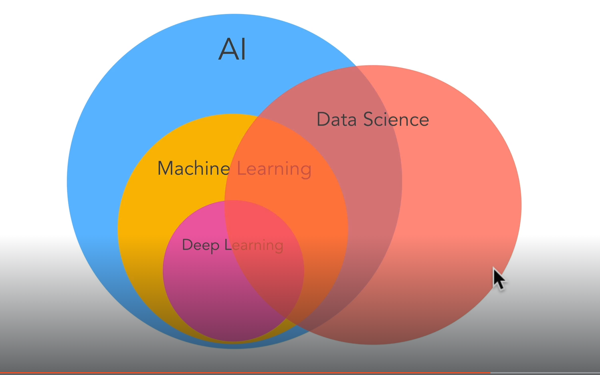
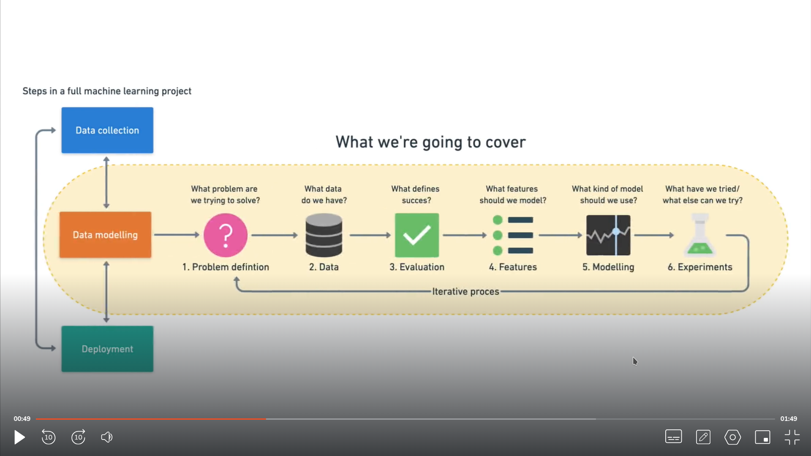

# Understanding AI, Machine Learning, and Data Science: A Comprehensive Guide

- [Understanding AI, Machine Learning, and Data Science: A Comprehensive Guide](#understanding-ai-machine-learning-and-data-science-a-comprehensive-guide)
  - [What is Artificial Intelligence?](#what-is-artificial-intelligence)
    - [Components of AI](#components-of-ai)
    - [Types of AI](#types-of-ai)
  - [What is Machine Learning (ML)?](#what-is-machine-learning-ml)
    - [Components of Machine Learning (ML)](#components-of-machine-learning-ml)
    - [Types of Machine Learning (ML)](#types-of-machine-learning-ml)
    - [Why Machine Learning?](#why-machine-learning)
    - [What Can Machine Learning Do for Me?](#what-can-machine-learning-do-for-me)
    - [Why Should You Learn ML?](#why-should-you-learn-ml)
  - [What is Data Science?](#what-is-data-science)
    - [Components of Data Science](#components-of-data-science)
    - [Key Skills in Data Science](#key-skills-in-data-science)
    - [Why is Data Science Important?](#why-is-data-science-important)
  - [How is Data Science Related to AI and Machine Learning?](#how-is-data-science-related-to-ai-and-machine-learning)
  - [Machine Learning and Data Science Framework](#machine-learning-and-data-science-framework)
    - [Machine Learning Framework](#machine-learning-framework)
    - [Data Science Framework](#data-science-framework)
    - [Machine Learning vs. Data Science Frameworks](#machine-learning-vs-data-science-frameworks)

## What is Artificial Intelligence?

Artificial Intelligence (AI) refers to the simulation of human intelligence in machines. These systems are designed to perform tasks that typically require human cognition, such as problem-solving, decision-making, language understanding, and learning.

- **Key Idea:** Build machines that can "think" or perform tasks intelligently.

### Components of AI

1. **Perception:**
   - Systems can interpret input from sensors (e.g., cameras, microphones) to "sense" the world.
   - Example: Facial recognition or voice recognition systems.
2. **Reasoning:**
   - Machines can evaluate information and make decisions based on logic.
   - Example: Chess-playing algorithms.
3. **Learning:**
   - Machines improve their performance using data (a key area of ML).
   - Example: Personalized recommendation systems.
4. **Natural Language Processing (NLP):**
   - Machines understand, interpret, and generate human language.
   - Example: Chatbots or virtual assistants like Siri.
5. **Problem Solving:**
   - AI can find solutions to complex issues.
   - Example: Pathfinding in games or optimizing delivery routes.

### Types of AI

1. **Narrow AI (Weak AI):**
   - Designed for specific tasks and limited domains.
   - Example: Virtual assistants, spam filters.
2. **General AI (Strong AI):**
   - Hypothetical systems capable of performing any intellectual task that a human can.
   - Currently a topic of research.
3. **Superintelligent AI:**
   - Refers to AI surpassing human intelligence in all aspects.
   - Still theoretical and raises ethical concerns.

## What is Machine Learning (ML)?

Machine Learning is a subset of Artificial Intelligence (AI) that enables systems to learn from data and improve their performance over time without being explicitly programmed. In simpler terms, ML focuses on developing algorithms that can process and analyze data, identify patterns, and make decisions or predictions.

- **Key Idea:** Teach computers to learn and adapt through experience (data).

### Components of Machine Learning (ML)

Machine Learning (ML) involves several key components that work together to allow systems to learn and make predictions or decisions. These components include:

1. **Data:**

   - The foundation of any ML model is data. It includes raw information that the model will use to learn and make predictions.
   - Types of data: Structured (tabular), unstructured (images, text, etc.), and semi-structured (XML, JSON).

2. **Algorithms:**

   - Algorithms are the mathematical models or procedures that process the data to make predictions or classify it.
   - Common algorithms: Linear regression, decision trees, support vector machines, k-nearest neighbors (KNN), etc.

3. **Model:**

   - A model is the output of an algorithm after learning from data. It makes predictions or decisions based on input data.
   - Example: A trained neural network model for image recognition.

4. **Training:**

   - The process where an ML model learns from data by adjusting internal parameters (such as weights in neural networks).
   - Training involves using labeled data (supervised learning) or unlabeled data (unsupervised learning) to improve model performance.

5. **Evaluation:**

   - After training, the model's performance is evaluated using metrics like accuracy, precision, recall, and F1-score.
   - Validation datasets are used to avoid overfitting and ensure generalizability.

6. **Testing:**

   - The final evaluation phase where the model is tested on unseen data to assess how well it generalizes to new information.

7. **Deployment:**
   - Once a model is trained, evaluated, and tested, it is deployed for real-world use to make predictions on new data.

### Types of Machine Learning (ML)

Machine Learning can be broadly categorized into three types based on how the model learns from data:

1. **Supervised Learning:**

   - In supervised learning, the model is trained on labeled data, where the input data is paired with the correct output.
   - The goal is to learn the mapping from inputs to outputs and generalize to unseen data.
   - Example: Predicting house prices from historical data (input features: square footage, number of bedrooms, etc., output: price).
   - Algorithms: Linear regression, decision trees, support vector machines.

2. **Unsupervised Learning:**

   - In unsupervised learning, the model is given data without labeled outputs, and its goal is to find hidden patterns or structures in the data.
   - It is typically used for clustering or dimensionality reduction.
   - Example: Grouping customers into clusters based on purchasing behavior.
   - Algorithms: K-means clustering, hierarchical clustering, principal component analysis (PCA).

3. **Reinforcement Learning:**

   - In reinforcement learning, the model learns through trial and error by interacting with an environment. It receives rewards or penalties based on actions and learns to maximize cumulative rewards over time.
   - Example: Training a robot to navigate a maze or a game-playing agent (e.g., AlphaGo).
   - Key components: Agent, environment, actions, rewards.

4. **Semi-Supervised Learning:**

   - Semi-supervised learning lies between supervised and unsupervised learning. The model is trained on a small amount of labeled data and a large amount of unlabeled data.
   - Example: Labeling a small subset of images and using unlabeled images to improve the model's accuracy.
   - Algorithms: Semi-supervised versions of supervised learning algorithms, such as self-training classifiers.

5. **Self-Supervised Learning:**
   - Self-supervised learning is a form of unsupervised learning where the system generates its own labels from the input data.
   - Example: Predicting the next word in a sentence (used in natural language processing).
   - Applications: NLP, computer vision (e.g., contrastive learning).

### Why Machine Learning?

1. **Automation of Tasks:** ML enables automation of repetitive and time-consuming tasks, freeing up human resources for more creative work.
2. **Data-Driven Insights:** It helps uncover hidden trends and insights from massive datasets, aiding decision-making.
3. **Scalability:** ML systems can handle large-scale data and make quick decisions, essential in today's data-driven world.
4. **Continuous Improvement:** As new data becomes available, ML systems refine their understanding and improve accuracy.

### What Can Machine Learning Do for Me?

1. **Personalized Recommendations:**
   - Example: Product recommendations on Amazon or Netflix's movie suggestions.
2. **Predictive Analytics:**
   - Example: Forecasting stock prices, predicting customer churn, or weather forecasting.
3. **Automation:**
   - Example: Automating customer support using chatbots or self-driving cars.
4. **Image and Speech Recognition:**
   - Example: Face unlock on smartphones, virtual assistants like Alexa or Google Assistant.
5. **Medical Diagnostics:**
   - Example: Detecting diseases like cancer from medical imaging.
6. **Fraud Detection:**
   - Example: Identifying unusual patterns in financial transactions to prevent fraud.
7. **Optimization:**
   - Example: Route optimization for logistics, energy management in smart grids.

### Why Should You Learn ML?

- **High Demand:** ML professionals are in high demand across industries.
- **Career Opportunities:** Opens doors to roles like ML Engineer, Data Scientist, AI Specialist, etc.
- **Interdisciplinary Applications:** ML knowledge is useful in finance, healthcare, marketing, transportation, and more.
- **Future-Proof Skill:** The reliance on intelligent systems continues to grow, making ML a valuable skill.

## What is Data Science?

Data Science is a multidisciplinary field that combines techniques from mathematics, statistics, computer science, and domain expertise to extract meaningful insights and knowledge from structured and unstructured data. It involves the entire process of collecting, cleaning, analyzing, and interpreting data to solve real-world problems.

- **Key Idea:** Leverage data to make informed decisions, predictions, and drive innovation.

### Components of Data Science

1. **Data Collection:**

   - Gathering data from various sources (e.g., databases, APIs, sensors, web scraping).
   - Tools: SQL, Python libraries like `pandas`, and `requests`.

2. **Data Cleaning and Preparation:**

   - Removing inconsistencies, handling missing values, and transforming data into a usable format.
   - Tools: Python (`pandas`, `numpy`), R, Excel.

3. **Exploratory Data Analysis (EDA):**

   - Understanding data distributions, identifying trends, and visualizing patterns.
   - Tools: Python (`matplotlib`, `seaborn`), Tableau, Power BI.

4. **Statistical and Machine Learning Modeling:**

   - Building models to predict, classify, or cluster data and optimize decision-making.
   - Tools: Python (`scikit-learn`, `tensorflow`), R, MATLAB.

5. **Data Visualization:**

   - Presenting findings in a clear and impactful way.
   - Tools: Python (`plotly`, `seaborn`), Tableau, D3.js.

6. **Communication and Storytelling:**
   - Conveying insights to stakeholders through reports, presentations, or dashboards.
   - Focus: Clarity, relevance, and actionable insights.

### Key Skills in Data Science

1. **Programming:**
   - Languages like Python and R are widely used for analysis and modeling.
2. **Statistics and Mathematics:**

   - Understanding statistical measures, probability, and linear algebra is crucial.

3. **Machine Learning:**

   - Familiarity with supervised, unsupervised, and deep learning techniques.

4. **Domain Knowledge:**

   - Expertise in the field where data science is applied (e.g., healthcare, finance).

5. **Big Data Tools:**
   - Skills in working with large datasets using Hadoop, Spark, or cloud platforms like AWS.

### Why is Data Science Important?

1. **Data-Driven Decision Making:**

   - Helps organizations make strategic choices based on factual data rather than intuition.

2. **Predictive Insights:**

   - Forecasting future trends, customer behavior, or potential risks.

3. **Automation and Optimization:**

   - Streamlines processes and improves efficiency in industries like manufacturing and logistics.

4. **Personalization:**
   - Powers personalized experiences in marketing, entertainment, and e-commerce.

## How is Data Science Related to AI and Machine Learning?

- **Artificial Intelligence (AI):** The overarching field focused on creating intelligent systems that can simulate human-like cognition and perform tasks autonomously. AI includes techniques like Machine Learning and rule-based systems.
- **Data Science**: A broader discipline that uses AI, Machine Learning, and statistical methods to analyze data and extract actionable insights.
- **Machine Learning (ML)**: A subset of AI and a key tool in Data Science that focuses on building algorithms and statistical models to enable machines to learn from data and improve performance over time.

## Machine Learning and Data Science Framework

The frameworks for Machine Learning (ML) and Data Science provide structured approaches to solving problems, guiding professionals through the process of handling data, creating models, and deriving actionable insights. These frameworks consist of several stages, methodologies, and tools.

### Machine Learning Framework

Machine Learning typically follows a series of stages to build, train, and deploy models:

1. **Problem Definition:**

   - Clearly define the problem to be solved and the goal of the machine learning model.
   - Example: Predicting customer churn, classifying email as spam or not.

2. **Data Collection:**

   - Gather relevant data from various sources like databases, APIs, or web scraping.
   - Example: Collecting sales data, website clickstream data, or sensor readings.

3. **Data Preprocessing:**

   - Clean, transform, and format the data to make it suitable for modeling.
   - Tasks include handling missing values, encoding categorical variables, normalizing or scaling data, and feature extraction.
   - Tools: Python (`pandas`, `numpy`), R.

4. **Model Selection:**

   - Choose the appropriate ML algorithm based on the problem type (supervised, unsupervised, reinforcement).
   - Example: Decision Trees, SVM for classification, Linear Regression for regression problems.
   - Tools: `scikit-learn`, `tensorflow`, `keras`.

5. **Model Training:**

   - Train the selected model on the preprocessed data. Adjust hyperparameters and optimize the model.
   - Tools: Python (`scikit-learn`, `tensorflow`, `keras`), R, MATLAB.

6. **Model Evaluation:**
   - Evaluate the model's performance using metrics such as accuracy, precision, recall, F1-score, etc.
   - Use techniques like cross-validation and confusion matrices.
   - Example: Validating the model's generalization ability on a test set.
7. **Model Tuning:**

   - Tune the model to improve performance using techniques like grid search, random search, or Bayesian optimization.
   - Adjust hyperparameters for better results.

8. **Model Deployment:**

   - Once the model performs satisfactorily, deploy it to a production environment for real-time predictions or batch processing.
   - Example: Integrating the model into a web application or using cloud-based platforms for deployment.

9. **Monitoring and Maintenance:**
   - Continuously monitor the model's performance in production. Retrain the model with new data or adjust as required.
   - Tools: Cloud services (AWS, Google Cloud), Docker, Kubernetes.

### Data Science Framework

Data Science follows a comprehensive process that includes data exploration, analysis, and visualization, along with the use of machine learning techniques for predictive and descriptive insights.

1. **Business Understanding:**

   - Understand the business problem, define goals, and set objectives.
   - Example: A company may need to predict customer lifetime value to focus marketing efforts.

2. **Data Collection:**

   - Collect data from multiple sources, including internal databases, third-party APIs, and external datasets.
   - Example: Collecting customer transactions, web analytics, social media data.

3. **Data Cleaning:**

   - Clean and preprocess the data by removing inconsistencies, handling missing values, and correcting errors.
   - Tasks: Data imputation, removing outliers, normalizing, encoding.

4. **Exploratory Data Analysis (EDA):**

   - Analyze and visualize the data to discover patterns, trends, correlations, and outliers.
   - Tools: Python (`matplotlib`, `seaborn`, `pandas`), R (ggplot2), Tableau, Power BI.

5. **Feature Engineering:**

   - Create new features or transform existing ones to improve the performance of ML models.
   - Tasks: Encoding categorical variables, scaling features, creating new derived features.

6. **Modeling:**

   - Apply various ML algorithms (supervised, unsupervised) to the data to build predictive models.
   - Tools: `scikit-learn`, `tensorflow`, `keras`, R (caret, randomForest).

7. **Model Evaluation:**

   - Assess the model's accuracy and performance on test data using appropriate evaluation metrics.
   - Example: For regression, use RMSE (Root Mean Squared Error); for classification, use confusion matrix, ROC curve.

8. **Communication and Reporting:**

   - Communicate insights to stakeholders using visualizations, reports, and dashboards.
   - Tools: Jupyter notebooks, Tableau, Power BI, written reports.

9. **Deployment and Monitoring:**

   - Deploy the model for use in production and set up a monitoring framework to track its performance over time.
   - Ensure that the model continues to meet business objectives.
   - Tools: Cloud platforms, Docker, Kubernetes.

10. **Maintenance:**

- Regularly retrain models with new data, adjust algorithms, or deploy new models as the business environment changes.

### Machine Learning vs. Data Science Frameworks

- **Machine Learning Framework**: Primarily focused on building, training, and deploying models.
- **Data Science Framework**: Broader and focuses on the entire lifecycle, including data collection, cleaning, analysis, model building, and reporting.

Both frameworks work together in solving data-driven problems by providing methods to extract insights and make data-driven decisions.

> If the model's performance is subpar, you may need to collect additional data, experiment with different features, or try alternative algorithms. If the problem definition evolves, it may require adjustments in data collection and modeling techniques. Essentially, there's no fixed procedure; some steps may need to be revisited iteratively, while others can be skipped depending on the situation.
