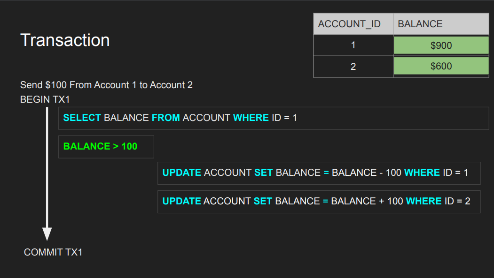

- [What is Transaction](#what-is-transaction)
  - [Key Properties of a Transaction: (ACID Properties)](#key-properties-of-a-transaction-acid-properties)
  - [Example of a Transaction](#example-of-a-transaction)
  - [Transaction Life Span](#transaction-life-span)
  - [Nature of a Transaction](#nature-of-a-transaction)
  - [Read-Only Transaction](#read-only-transaction)
    - [Use Case of a Read-Only Transaction](#use-case-of-a-read-only-transaction)
    - [How Read-Only Transactions Work:](#how-read-only-transactions-work)
- [ACID](#acid)
- [Atomicity](#atomicity)
  - [Scenario:](#scenario)
  - [Why Atomicity Matters:](#why-atomicity-matters)
  - [How Atomicity Works:](#how-atomicity-works)
  - [Conclusion:](#conclusion)

## What is Transaction

In the context of databases, a transaction is a sequence of operations performed as a single, indivisible unit of work. A transaction ensures that the database remains in a consistent state, even in the case of system failures or crashes. All operations within the transaction must be completed successfully, or none at all (i.e., atomicity). If the transaction cannot be completed, all changes made by it are rolled back, maintaining database integrity.

### Key Properties of a Transaction: (ACID Properties)

- **Atomicity:** A transaction is an atomic unit; either all of its operations are executed, or none are.
- **Consistency:** A transaction ensures that the database transitions from one consistent state to another, adhering to all defined rules, constraints, and triggers.
- **Isolation:** Even if multiple transactions are occurring concurrently, each transaction's operations are isolated from others until it is complete.
- **Durability:** Once a transaction is committed, the changes it made are permanent, even in the event of a system crash.

### Example of a Transaction

Suppose you're transferring money from one bank account to another. The transaction would involve the following steps:

1. **Debit** the source account (reduce the balance).
2. **Credit** the destination account (increase the balance).

If either of these steps fails, the entire transaction is rolled back, and the accounts are restored to their original state.

### Transaction Life Span

The life span of a transaction is the period from its beginning to its commitment or rollback. It typically involves the following stages:

- **Begin Transaction:** Marks the start of a transaction.
- **Execution of Operations**: This is where the database operations like read, insert, update, or delete occur.
- **Commit**: If all operations are successful, the transaction is committed, making all changes permanent.
- **Rollback**: If an error occurs or a failure is detected, the transaction is rolled back, and all changes are reverted to the state before the transaction began.



### Nature of a Transaction

- **Consistency Maintenance:** Transactions maintain data consistency by ensuring that database operations comply with the database schema and integrity constraints (e.g., foreign keys, unique constraints).

- **Isolation of Operations:** Transactions are isolated from one another, meaning the actions of one transaction should not interfere with another. For example, when two transactions are accessing the same data simultaneously, their changes must not conflict.
- **Error Handling and Recovery:** If a system failure occurs during a transaction, the database uses the logs to either rollback the transaction or ensure durability if it has been committed.

### Read-Only Transaction

Transactions are primarily associated with changing and modifying data, but it is indeed normal and valid to have **read-only transactions** as well. These are used when the goal is to retrieve data without making any changes to the database.

#### Use Case of a Read-Only Transaction

A read-only transaction might be used when you need to generate reports or analyze data but want to ensure that the data you are accessing is consistent, meaning that it reflects a single point in time, even if other transactions are ongoing and modifying the database during your read operation.

For example:

- **Reporting or Analytics:** You might generate a report that aggregates or analyzes a large amount of data. You want that report to reflect the state of the data at the moment the transaction began, not including any updates that happen during the report's generation.
-
- **Data Snapshot:** If you're working with large-scale data (e.g., in financial systems or inventory tracking), you might need to ensure that your read query does not show incomplete or inconsistent data due to concurrent updates from other transactions.

#### How Read-Only Transactions Work:

- When a transaction is read-only, it does not require any locks or changes to the data, and it simply fetches the data without modifying it.
- The system will still need to ensure consistency and isolation for the read operation, which may involve mechanisms like snapshot isolation or serializable isolation.
- In certain database systems, consistent snapshots of data can be achieved without blocking other transactions, which improves performance while maintaining consistency during read-only operations.

In summary, transactions are crucial for ensuring data integrity, consistency, and reliability in a database system, with their life span being managed through phases of execution and completion or failure.

## ACID

Acid, which stands for _**Atomicity. Consistency, isolation and durability**_ are four critical properties of relational database systems. I think any engineer working with relational databases such as Postgres, MySQL, SQL Server, Oracle and even NoSQL databases or graph databases must really understand these four building blocks and fundamentals and first principles that build database systems. By following these `ACID` principles, databases can ensure that transactions are processed reliably, securely, and efficiently.

## Atomicity

Atomicity is one of the key **ACID** properties that ensure that a transaction is treated as a single, indivisible unit. This means that:

- All operations within a transaction must succeed.
- If any operation within the transaction fails, all prior operations within the transaction are undone (rolled back) to maintain consistency.

### Scenario:

Let's walk through the example you provided with Account Balance Updates:

**- Before Transaction:**

- Account 1 has $900.
- Account 2 has $500.

**- Transaction:**

- You want to **transfer $100** from Account 1 to Account 2.
- Step 1: Debit $100 from Account 1 → New balance = $800.
- Step 2: Credit $100 to Account 2 → New balance = $600.

**- Failure Before Commit:**

- If the system crashes after Account 1 is debited (i.e., $100 is subtracted from Account 1) but before the transaction can commit the $100 credit to Account 2, the transaction is in an inconsistent state.
- Result: Account 1 shows a balance of $800, but Account 2 has not been updated and still shows $500. This is a partial transaction and leads to data inconsistency.

**- Atomicity in Action:**

- In the event of such a failure (like a system crash or other error), the database must ensure that all changes made during the transaction are either completely applied (committed) or completely reverted (rolled back).
- Rollback: If the database crashes, upon recovery, the system should automatically rollback any partial transactions that were not fully committed. This means it will undo the debit from Account 1 and leave both accounts in a consistent state (both remain as they were before the transaction began).

**- After Recovery:**

- The database should restore the balances to their pre-transaction state:
  - Account 1: $900 (not $800).
  - Account 2: $500 (no change).

### Why Atomicity Matters:

- **Consistency:** Without atomicity, the system could end up in a state where some parts of a transaction are applied, and others are not, leading to inconsistent data. In this example, if the system fails halfway through the transaction, it results in the loss of money (debit occurred, but credit didn’t).

- **Data Integrity:** Atomicity ensures data integrity by preventing partial updates, which can corrupt the data and lead to loss of information.

### How Atomicity Works:

1. **Begin Transaction:** A transaction starts, and database operations are carried out.
2. **Commit:** If all operations succeed, the transaction is committed, and changes are applied to the database.
3. **Rollback:** If any operation fails or the system crashes, the transaction is rolled back, undoing all changes made during the transaction, ensuring the database is in a consistent state.

In the case of a database crash before a commit, the transaction log helps restore the database to its consistent state:

- When the system restarts, the database uses a log-based recovery mechanism to detect incomplete transactions and automatically roll them back to restore consistency.

```SQL
BEGIN TRANSACTION;

UPDATE Accounts
SET Balance = Balance - 100
WHERE Account_ID = 1;  -- Debit $100 from Account 1

UPDATE Accounts
SET Balance = Balance + 100
WHERE Account_ID = 2;  -- Credit $100 to Account 2

-- If everything works, commit the transaction
COMMIT;

-- If something fails, rollback
ROLLBACK;
```

- If `COMMIT` succeeds: Both updates (debit and credit) are permanent.
- If `ROLLBACK` is triggered due to failure: The database undoes both updates.

### Conclusion:

- **Atomicity** is fundamental for ensuring that a set of operations within a transaction is treated as **a single unit** of work.
- If a failure occurs at any point, the database should **rollback** all operations within the transaction, ensuring **no partial updates** and maintaining **consistency** and **data integrity**.
- The database handles this rollback automatically during recovery (e.g., after a system crash) using transaction logs.

Atomicity prevents situations like the one I described above, where money is debited from one account but not credited to another, ensuring reliable, consistent, and trustworthy transactions in the system.
